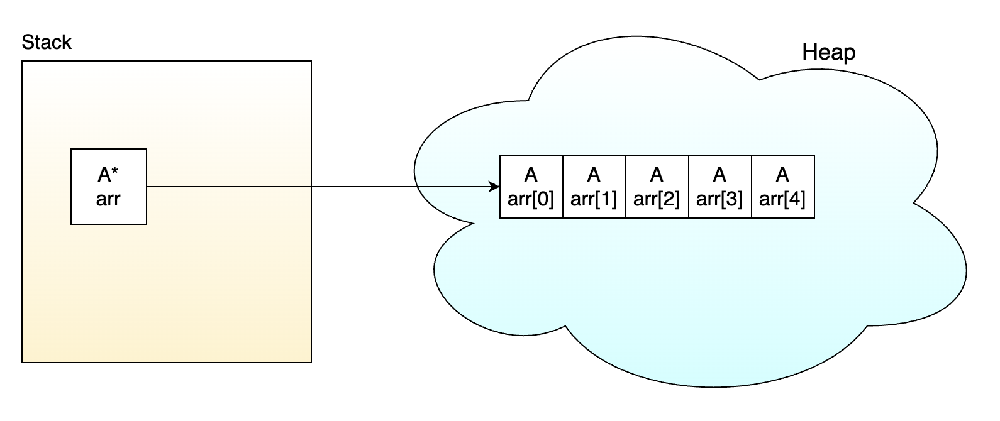
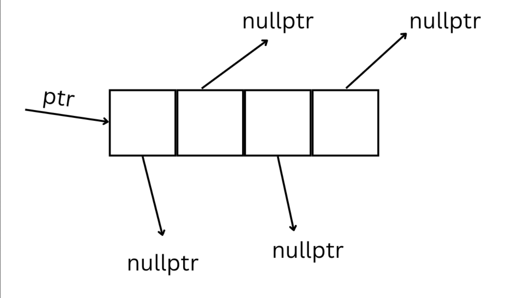
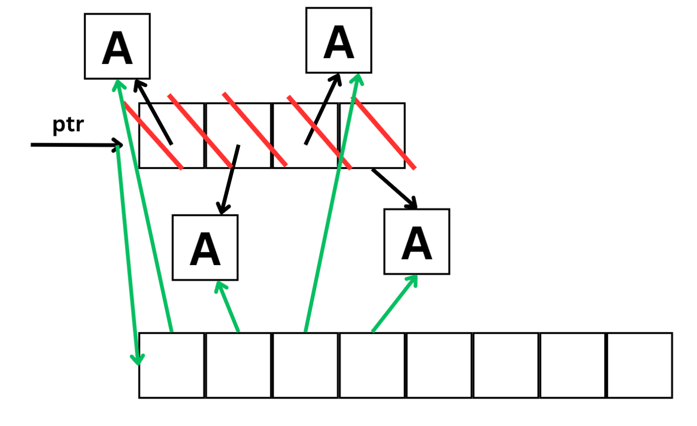

# Съдържание

## [Масиви от Обекти и Масиви от Указатели в C++](#масиви-от-обекти-и-масиви-от-указатели-в-c)
1. [Масив от обекти](#1-масив-от-обекти)
2. [Масив от указатели към обекти](#2-масив-от-указатели-към-обекти)
3. [Разлика в паметта](#3-разлика-в-паметта)
4. [Голямата четворка при клас с масив от указатели](#4-голямата-четворка-при-клас-с-масив-от-указатели)
5. [Пълен пример](#5-пълен-пример)
6. [Edge Cases и капани](#6-edge-cases-и-капани)
7. [Обобщение](#7-обобщение)
---

## [Rule of Five(Голямата шестица) и Move Семантика в C++](#rule-of-five-и-move-семантика-в-c)


1. [Какво е Rule of Five?](#1-какво-е-rule-of-five)
2. [lvalue и rvalue](#2-lvalue-и-rvalue)
3. [rvalue референция `&&`](#3-rvalue-референция-)
4. [std::move](#4-stdmove)
5. [Move конструктор](#5-move-конструктор)
6. [Move оператор=](#6-move-оператор)
7. [Петте специални функции заедно](#7-петте-специални-функции-заедно)
8. [Кога компилаторът генерира move автоматично?](#8-кога-компилаторът-генерира-move-автоматично)
9. [noexcept при move](#9-noexcept-при-move)
10. [Пълен пример — клас String](#10-пълен-пример--клас-string)
11. [Edge Cases и капани](#11-edge-cases-и-капани)
12. [Обобщение](#12-обобщение)

---

# Масиви от Обекти и Масиви от Указатели в C++

---

## Основни дефиниции

> **Масив от обекти** — наредена колекция от обекти от един и същ тип, наредени непосредствено един след друг в паметта. Всеки елемент е самостоятелен обект с автоматично управление на живота.

> **Масив от указатели** — наредена колекция от адреси, всеки от които сочи към обект в heap-а. Масивът съдържа само адреси — не самите обекти.

> **Конструктор по подразбиране** — конструктор без параметри. Необходим при `T arr[N]` и `new T[N]`, защото компилаторът трябва да конструира всеки елемент без аргументи.

> **`delete[]`** — оператор за освобождаване на динамичен масив. Извиква деструктора на всеки елемент преди да освободи паметта. Задължително се ползва вместо `delete`, когато паметта е заделена с `new[]`.

> **`nullptr`** — стойност на указател, която означава „не сочи към нищо". При масив от указатели дадена позиция може да е `nullptr`, ако обектът все още не е създаден.

> **Shallow copy** — копиране само на стойността на указателя, без данните, към които той сочи. Двата обекта споделят едни и същи данни — опасно при динамична памет.

> **Deep copy** — заделяне на нова памет и копиране на съдържанието. Двата обекта имат напълно независими копия на данните.

---

## 1. Масив от обекти

Всеки елемент е **пълноценен обект**. Конструкторите се извикват при създаването, деструкторите — при унищожаването, автоматично.

### На стека

```cpp
class Student {
    char   name[50];
    double grade;
public:
    Student() : grade(0) { name[0] = '\0'; }
    Student(const char* n, double g) : grade(g) {
        strncpy(name, n, 49); name[49] = '\0';
    }
    ~Student() { std::cout << "~Student(" << name << ")\n"; }
    void print() const { std::cout << name << " — " << grade << "\n"; }
};

Student arr[3] = {
    Student("Иван",  5.5),
    Student("Мария", 6.0),
    Student("Петър", 4.0)
};

for (int i = 0; i < 3; i++)
    arr[i].print();   // достъп с точка
// ~Student се извиква автоматично при излизане от scope
```

### На heap-а

```cpp
Student* arr = new Student[3];   // извиква Student() три пъти
arr[0] = Student("Иван",  5.5);
arr[1] = Student("Мария", 6.0);
arr[2] = Student("Петър", 4.0);

for (int i = 0; i < 3; i++)
    arr[i].print();

delete[] arr;   // задължително [] — извиква ~Student три пъти
```

### Изискване — конструктор по подразбиране

`new T[N]` и декларация `T arr[N]` без инициализатор извикват **конструктора по подразбиране** на всеки елемент. Ако го няма — грешка при компилация:

```cpp
class Car {
public:
    Car(const char* model) { /* ... */ }
    // Няма Car()!
};

Car arr[3];            // ❌ ГРЕШКА
Car* arr = new Car[3]; // ❌ ГРЕШКА
```

### Ред на конструиране и унищожаване

Конструкторите се извикват от индекс **0 нагоре**, деструкторите — в **обратен ред**:

```
Конструиране:  arr[0] → arr[1] → arr[2]
Унищожаване:   arr[2] → arr[1] → arr[0]
```

---

## 2. Масив от указатели към обекти

Масивът съдържа **адреси** на обекти — не самите обекти. Всеки обект се създава и унищожава **ръчно**.

```cpp
const int SIZE = 3;
Student* arr[SIZE];   // масив от указатели на стека

arr[0] = new Student("Иван",  5.5);
arr[1] = new Student("Мария", 6.0);
arr[2] = new Student("Петър", 4.0);

for (int i = 0; i < SIZE; i++)
    arr[i]->print();   // достъп с ->

// Задължително освобождаване — всеки обект поотделно:
for (int i = 0; i < SIZE; i++) {
    delete arr[i];
    arr[i] = nullptr;
}
```

### Динамичен масив от указатели

Когато размерът не е известен по време на компилация:

```cpp
int n;
std::cin >> n;

А** arr = new А*[n];   // масив от n указателя

for (int i = 0; i < n; i++)
    arr[i] = new Student(/* ... */);

// Освобождаване — двустепенно:
for (int i = 0; i < n; i++)
    delete arr[i];      // 1. всеки обект
delete[] arr;           // 2. масивът от указатели
```


### Предимства пред масив от обекти

- **Не изисква** конструктор по подразбиране
- Указателите могат да са `nullptr` — не всяка позиция трябва да е заета
- При сортиране се разместват само указателите — обектите не се копират
- Позволява обекти с **различни размери** (полиморфизъм)

```cpp
// Сортиране — само указателите се разменят, обектите остават на място
void sortByGrade(Student* arr[], int size) {
    for (int i = 0; i < size - 1; i++)
        for (int j = 0; j < size - i - 1; j++)
            if (arr[j]->getGrade() > arr[j+1]->getGrade())
                std::swap(arr[j], arr[j+1]);
}
```

---

## 3. Разлика в паметта

### Масив от обекти — непрекъснат блок

```
arr:
┌──────────────┬──────────────┬──────────────┐
│  Иван  | 5.5 │  Мария | 6.0 │  Петър | 4.0 │
└──────────────┴──────────────┴──────────────┘
 sizeof(Student) байта на елемент, един блок
```

#### На картинка:




### Масив от указатели — разпръснати обекти

```
arr:
┌──────┬──────┬──────┐
│  *   │  *   │  *   │   ← масивът (само адреси)
└──┼───┴──┼───┴──┼───┘
   │      │      │
   ▼      ▼      ▼
[Иван] [Мария] [Петър]    ← обектите (разпръснати в heap-а)
```

#### На картинка:


## A** vs A*

### A** - масив от указатели към обекти
Предимства:
- бърз swap
- бърз resize
- не се изисква default конструктор
- не заема излишна памет
- може да има "дупки" в масива
- използва се за **полиморфизъм**

Недостатъци:
- няма locality


---
### Примери:
### Вариант 1
 ```c++
class A {};

A* arr = new A[n]; // def constr

int capacity = n;
int size = 0;
 ```

Създаваме масив с **capacity** от n ел-та и следим запълнените клетки чрез **size**.

Нека има следната функция за добавяне на нов обект към масива:
 ```c++
Add(const A& obj)
{
    if(size == capacity)
        resize(...);
    
    arr[size++] = obj; //op=
}
 ```
Ако решим да добавим елемент при запълнен масив, то трябва да направим нов масив и да копираме всяко А в новия масив, което ни коства ресурси.


##### Ползи:
- Locality - много по-бързо се обхождат колекции, чиито елементи са наредени последователно
- В най-добрия и средния случай (т.е когато нямаме resize) добавянето на елемент е със сложност O(1) - една стъпка

##### Недостатъци:
- Харчим много памет
- Разместването на елементи в колекцията е скъпа операция 


### Вариант 2 - указател към указатели
 ```c++
class A {};

A** ptr;
ptr = new A*[n]{nullptr};

capacity = n;
size = 0;
 ```
 

вътре клетките са `nullptr` и не сочат към никъде.

Нека има следната функция за добавяне на нов обект към масива:

 ```c++
Add(const A& obj)
{
    if(size == capacity)
        resize(...);
    
    arr[size++] = new A(obj); //copy constr
}
 ```

Ако решим да добавим елемент при запълнен масив, то в този случай няма да създаване нови обекти.





##### Ползи:
 - Бързо разместване на обектите в колекцията - не се изисква да се копират. Само разместваме указателите
 - Не се изисква същестуването на деф. контруктор на A.
 - Възможно е да имаме "празна клетка", като се възползваме от възможната nullptr стойност.

##### Недостатъци:
- Няма Locality - бавно обхождане на елементите 

### Освобождавне на ресурсите при двете реализации
- При първата:
```c++
delete[] arr;
```
- При втората:
```c++
for(int i = 0; i < size; i++)
{
    delete ptr[i]; // delete the objects
}

delete[] ptr;
```

---

## 4. Голямата четворка при клас с масив от указатели

Клас, притежаващ масив от указатели към обекти, **задължително** имплементира Голямата четворка. Автоматично генерираните версии правят shallow copy — двата обекта биха споделяли един масив.

```cpp
class Classroom {
    Student** students;
    int       count;
    int       capacity;

    void free() {
        for (int i = 0; i < count; i++)
            delete students[i];
        delete[] students;
    }

    void copyFrom(const Classroom& other) {
        capacity = other.capacity;
        count    = other.count;
        students = new Student*[capacity];
        for (int i = 0; i < count; i++)
            students[i] = new Student(*other.students[i]);
        for (int i = count; i < capacity; i++)
            students[i] = nullptr;
    }

public:
    // --- Конструктор ---
    explicit Classroom(int cap) : count(0), capacity(cap) {
        students = new Student*[capacity]();   // нулира всички указатели
    }

    // --- Деструктор ---
    ~Classroom() { free(); }

    // --- Копиращ конструктор ---
    Classroom(const Classroom& other) { copyFrom(other); }

    // --- Оператор= ---
    Classroom& operator=(const Classroom& other) {
        if (this != &other) { free(); copyFrom(other); }
        return *this;
    }

    void add(const char* name, double grade) {
        if (count < capacity)
            students[count++] = new Student(name, grade);
    }

    void print() const {
        for (int i = 0; i < count; i++)
            students[i]->print();
    }
};
```

```cpp
int main() {
    Classroom a(3);
    a.add("Иван",  5.5);
    a.add("Мария", 6.0);

    Classroom b = a;   // deep copy — b има собствени обекти
    b.add("Петър", 4.0);

    std::cout << "a:\n"; a.print();
    std::cout << "b:\n"; b.print();
}
// a:
// Иван — 5.5
// Мария — 6
// b:
// Иван — 5.5
// Мария — 6
// Петър — 4
```

---

## 5. Пълен пример

```cpp
#include <iostream>
#include <cstring>
#include <algorithm>

class Student {
    char   name[50];
    double grade;
public:
    Student() : grade(0) { name[0] = '\0'; }
    Student(const char* n, double g) : grade(g) {
        strncpy(name, n, 49); name[49] = '\0';
    }
    const char* getName()  const { return name;  }
    double      getGrade() const { return grade; }
    void print() const { std::cout << name << " — " << grade << "\n"; }
};

Student* findBest(Student* arr[], int size) {
    Student* best = nullptr;
    for (int i = 0; i < size; i++)
        if (arr[i] && (!best || arr[i]->getGrade() > best->getGrade()))
            best = arr[i];
    return best;
}

double average(Student* arr[], int size) {
    double sum = 0; int cnt = 0;
    for (int i = 0; i < size; i++)
        if (arr[i]) { sum += arr[i]->getGrade(); cnt++; }
    return cnt ? sum / cnt : 0.0;
}

int main() {
    const int SIZE = 4;

    // --- Масив от обекти ---
    std::cout << "=== Масив от обекти ===\n";
    Student objArr[SIZE] = {
        {"Иван",   5.5}, {"Мария", 6.0},
        {"Петър",  4.0}, {"Анна",  5.75}
    };
    for (int i = 0; i < SIZE; i++) objArr[i].print();

    // --- Масив от указатели ---
    std::cout << "\n=== Масив от указатели ===\n";
    Student* pArr[SIZE] = {
        new Student("Иван",  5.5),
        new Student("Мария", 6.0),
        new Student("Петър", 4.0),
        new Student("Анна",  5.75)
    };

    // Сортиране по оценка
    std::sort(pArr, pArr + SIZE, [](Student* a, Student* b) {
        return a->getGrade() > b->getGrade();
    });

    std::cout << "Сортирани по оценка:\n";
    for (int i = 0; i < SIZE; i++) pArr[i]->print();

    std::cout << "Най-добър: "; findBest(pArr, SIZE)->print();
    std::cout << "Среден успех: " << average(pArr, SIZE) << "\n";

    for (int i = 0; i < SIZE; i++) { delete pArr[i]; pArr[i] = nullptr; }
}
```

```
=== Масив от обекти ===
Иван — 5.5
Мария — 6
Петър — 4
Анна — 5.75

=== Масив от указатели ===
Сортирани по оценка:
Мария — 6
Анна — 5.75
Иван — 5.5
Петър — 4
Най-добър: Мария — 6
Среден успех: 5.3125
```

---

## 6. Edge Cases и капани

### Липсващ конструктор по подразбиране

```cpp
class Car { public: Car(const char* m) {} };

Car arr[3];             // ❌ ГРЕШКА
Car* p = new Car[3];    // ❌ ГРЕШКА

// ✅ Добави Car() {} или ползвай масив от указатели:
Car* pArr[3];
pArr[0] = new Car("BMW");
```

---

### `delete` вместо `delete[]`

```cpp
Student* arr = new Student[5];
delete arr;    // ❌ undefined behavior — деструкторите на [1..4] не се извикват
delete[] arr;  // ✅
```

---

### Забравено освобождаване на обектите

```cpp
Student* arr[3];
arr[0] = new Student("Иван", 5);
arr[1] = new Student("Мария", 6);
arr[2] = new Student("Петър", 4);
// ❌ Масивът изчезва (стек), но трите обекта в heap-а изтичат!

// ✅
for (int i = 0; i < 3; i++) { delete arr[i]; arr[i] = nullptr; }
```

---

### Дереференциране на `nullptr`

```cpp
Student* arr[3];
arr[0] = new Student("Иван", 5);
arr[1] = nullptr;
arr[1]->print();   // ❌ segfault

// ✅
for (int i = 0; i < 3; i++)
    if (arr[i]) arr[i]->print();
```

---

### Shallow copy при клас с масив от указатели

```cpp
Classroom a(3);
a.add("Иван", 5);
Classroom b = a;   // ❌ без копиращ конструктор — b.students == a.students
                    //    при ~b → delete на обектите → при ~a → double free → crash

// ✅ Имплементирай copyFrom() / free() и Голямата четворка (вж. Секция 4)
```

---

## 7. Обобщение

```
┌─────────────────────┬────────────────────┬────────────────────────────┐
│                     │  Масив от обекти   │  Масив от указатели        │
├─────────────────────┼────────────────────┼────────────────────────────┤
│ Default constructor │  Задължителен      │  Не е нужен                │
│ nullptr елементи    │  Не може           │  Може                      │
│ Достъп              │  arr[i].method()   │  arr[i]->method()          │
│ Сортиране           │  Копира обектите   │  Само адреси               │
│ Освобождаване       │  delete[] / авт.   │  delete всеки + delete[]   │
│ Памет               │  Непрекъснат блок  │  Разпръснати обекти        │
└─────────────────────┴────────────────────┴────────────────────────────┘
```

```
✅ При new[] → задължително delete[]
✅ При масив от указатели → delete всеки обект поотделно, после delete[] масива
✅ Проверявай за nullptr преди arr[i]->method()
✅ При клас с Student** → имплементирай Голямата четворка

❌ delete вместо delete[] → undefined behavior
❌ Забравено delete на обектите → memory leak
❌ Достъп до nullptr → segfault
❌ Автоматично копиране на клас с указатели → double free
```

> **Основен извод:** Масивът от обекти управлява паметта автоматично, но изисква конструктор по подразбиране. Масивът от указатели дава гъвкавост — без изискване за default constructor, с `nullptr` позиции и ефективно сортиране — но цената е ръчно управление на паметта и задължителна Голяма четворка при клас, притежаващ такъв масив.


# Rule of Five и Move Семантика в C++

---

## Основни дефиниции

> **lvalue** — израз с постоянен адрес в паметта. Именувана променлива или функция, връщаща референция. Може да стои вляво от `=`.

> **rvalue** — израз без постоянен адрес. Временна стойност, литерал, резултат от аритметичен израз. Не може да стои вляво от `=`.

> **rvalue референция (`&&`)** — референция, която може да се обвърже само с rvalue. Сигнализира „този обект е временен — ресурсите му могат да се вземат".

> **std::move** — преобразува lvalue в xvalue (rvalue). Не мести нищо — само казва на компилатора „третирай този обект като временен".

> **Move конструктор** — специален конструктор, който „краде" ресурсите на временен обект вместо да ги копира. Оставя source обекта в празно, но валидно състояние.

> **Move оператор=** — оператор за присвояване, който краде ресурсите на временен обект. Работи върху вече съществуващ обект.

> **Rule of Five** — ако класът дефинира едно от петте: деструктор, copy конструктор, copy `operator=`, move конструктор, move `operator=` — трябва да дефинира и останалите четири.

---

## 1. Какво е Rule of Five?

Rule of Three (деструктор + copy конструктор + copy `operator=`) важи при класове с динамична памет. С въвеждането на move семантика в C++11, правилото се разширява до **Rule of Five** — добавят се move конструкторът и move `operator=`.

```
Rule of Five:
┌──────────────────────────────────────┐
│  1. Деструктор           ~T()        │
│  2. Copy конструктор     T(const T&) │
│  3. Copy оператор=       T& op=(const T&) │
│  4. Move конструктор     T(T&&)      │  ← ново в C++11
│  5. Move оператор=       T& op=(T&&) │  ← ново в C++11
└──────────────────────────────────────┘
```

### Защо са нужни move операциите?

При copy конструктора се заделя нова памет и се копира съдържанието — скъпа операция при голям обект. Ако source обектът е **временен** (rvalue) — скоро ще бъде унищожен — копирането е безсмислено. Move операциите **крадат** ресурсите вместо да ги копират:

```
Copy:                              Move:
┌────────┐   deep copy   ┌────────┐   ┌────────┐  steal ptr  ┌────────┐
│ source │ ──────────── │  dest  │   │ source │ ──────────► │  dest  │
│ data──►│[A][B][C]     │ data──►│   │ data──►│[A][B][C]   │ data──►│[A][B][C]
└────────┘   (нова памет)└────────┘   └────────┘             └────────┘
                                       source.data = nullptr  (няма ново заделяне)
```

---

## 2. lvalue и rvalue

Всеки израз в C++ е lvalue или rvalue.

**lvalue** — израз с адрес в паметта. Именувани обекти, функции, връщащи референция:

```cpp
int x = 5;        // x е lvalue — има адрес, може да се вземе &x
int& getRef();    // getRef() е lvalue — връща референция

getRef() = 10;    // ✅ OK — lvalue може да стои вляво от =
x = 42;           // ✅ OK
```

**rvalue** — временна стойност без постоянен адрес:

```cpp
4 = x;            // ❌ 4 е rvalue — не може вляво от =
(x + 1) = 4;     // ❌ (x+1) е rvalue

int getValue();   // getValue() е rvalue — връща копие, не референция
getValue() = 4;   // ❌ ГРЕШКА
```

### Кога функция приема lvalue, rvalue или и двете

```cpp
void f(X obj);          // приема lvalue И rvalue (копира или мести)
void g(X& ref);         // приема САМО lvalue
void h(const X& obj);   // приема lvalue И rvalue (не може да модифицира)
void t(X&& obj);        // приема САМО rvalue
```

---

## 3. rvalue референция `&&`

rvalue референцията (`&&`) е референция, която може да се обвърже **само с rvalue**. Именно тя позволява разграничаването на временни обекти от трайни.

```cpp
int i = 42;

int&  lref  = i;        // ✅ lvalue референция към lvalue
int&& rref1 = i;        // ❌ rvalue референция НЕ може към lvalue

int&& rref2 = i * 42;   // ✅ (i * 42) е rvalue — временен резултат
int&& rref3 = 100;      // ✅ 100 е rvalue — литерал

const int& cr = i * 42; // ✅ const lvalue референция може към rvalue
```

### Защо е полезна?

С `&&` може да се предефинира функционалност — веднъж за lvalue (copy), веднъж за rvalue (move):

```cpp
void print(const std::string& str) {   // извиква се за lvalue
    std::cout << "copy: " << str << "\n";
}

void print(std::string&& str) {        // извиква се за rvalue
    std::cout << "move: " << str << "\n";
}

std::string s = "Иван";
print(s);          // lvalue → първата функция → "copy: Иван"
print("Мария");    // rvalue → втората функция → "move: Мария"
```

---

## 4. `std::move`

`std::move` **не мести нищо**. Той преобразува lvalue в xvalue (тип rvalue), като казва на компилатора: „третирай този обект като временен — ресурсите му могат да се вземат."

```cpp
int x = 5;
int&& rref = std::move(x);   // ✅ std::move преобразува x към rvalue
```

### Практическа употреба

```cpp
std::string s1 = "hello";
std::string s2 = s1;              // copy — s1 остава непроменен
std::string s3 = std::move(s1);   // move — s1 е "ограбен"

std::cout << s1 << "\n";   // "" или undefined — s1 е в неопределено но валидно стояние
std::cout << s3 << "\n";   // "hello"
```

### Важно — след `std::move` обектът не трябва да се ползва

```cpp
std::string s = "данни";
std::string t = std::move(s);   // s е "ограбен"

s.push_back('x');   // ✅ технически валидно — но s е в неопределено съдържание
std::cout << s;     // ⚠️ не разчитай на стойността
```

Единствените сигурни операции след `std::move` върху обект са:
- Присвояване на нова стойност
- Унищожаване

---

## 5. Move конструктор

Move конструкторът се извиква при **създаване на нов обект от rvalue**. Краде ресурсите на source обекта и го оставя в празно, но валидно (унищожаемо) състояние.

### Сигнатура

```cpp
T(T&& other) noexcept;
//  ^^ rvalue референция — неконстантна!
```

За разлика от copy конструктора, параметърът е **неконстантен** — трябва да модифицираме source обекта (да нулираме неговия указател).

### Имплементация

```cpp
class Student {
    char*  name;
    int    age;

public:
    // Move конструктор
    Student(Student&& other) noexcept
        : name(other.name), age(other.age) {   // "крадем" данните
        other.name = nullptr;                   // нулираме source
        other.age  = 0;
        std::cout << "Move конструктор\n";
    }
};
```

Стъпките:
1. Вземаме указателя на `other` — не заделяме нова памет
2. Нулираме `other.name = nullptr` — при унищожаването на `other` `delete[] nullptr` е безопасно

### Кога се извиква

```cpp
Student createStudent() {
    Student temp("Иван", 20);
    return temp;   // компилаторът може да ползва move (RVO/NRVO)
}

Student s1("Мария", 21);

Student s2 = createStudent();     // move от rvalue (временен обект)
Student s3 = std::move(s1);       // move от lvalue — изрично с std::move
```

---

## 6. Move оператор=

Move `operator=` се извиква при **присвояване на rvalue на вече съществуващ обект**. Освобождава собствените ресурси, след което краде ресурсите на source.

### Сигнатура

```cpp
T& operator=(T&& other) noexcept;
```

### Имплементация

```cpp
Student& operator=(Student&& other) noexcept {
    // 1. Самоприсвояване
    if (this == &other)
        return *this;

    // 2. Освобождаване на собствените ресурси
    free();

    // 3. Кражба на ресурсите
    name = other.name;
    age  = other.age;

    // 4. Нулиране на source
    other.name = nullptr;
    other.age  = 0;

    std::cout << "Move оператор=\n";
    return *this;
}
```

### Разлика между move конструктор и move `operator=`

```cpp
Student a("Иван", 20);

Student b = std::move(a);   // MOVE КОНСТРУКТОР — b се създава сега
                             // b не е съществувал преди

Student c("Мария", 21);
c = std::move(a);           // MOVE ОПЕРАТОР= — c вече съществуваше
                             // трябва първо да се освободят ресурсите на c
```

---

## 7. Петте специални функции заедно

```cpp
class String {
    char* data;
    int   length;

    void free() {
        delete[] data;
        data   = nullptr;
        length = 0;
    }

    void copyFrom(const String& other) {
        length = other.length;
        data   = new char[length + 1];
        strcpy(data, other.data);
    }

public:
    // 1. Конструктор
    String(const char* str = "") : length(strlen(str)) {
        data = new char[length + 1];
        strcpy(data, str);
    }

    // 2. Деструктор
    ~String() { free(); }

    // 3. Copy конструктор
    String(const String& other) {
        copyFrom(other);
        std::cout << "Copy конструктор\n";
    }

    // 4. Copy оператор=
    String& operator=(const String& other) {
        if (this != &other) { free(); copyFrom(other); }
        std::cout << "Copy оператор=\n";
        return *this;
    }

    // 5. Move конструктор
    String(String&& other) noexcept
        : data(other.data), length(other.length) {
        other.data   = nullptr;
        other.length = 0;
        std::cout << "Move конструктор\n";
    }

    // 6. Move оператор=
    String& operator=(String&& other) noexcept {
        if (this != &other) {
            free();
            data         = other.data;
            length       = other.length;
            other.data   = nullptr;
            other.length = 0;
        }
        std::cout << "Move оператор=\n";
        return *this;
    }

    void print() const { std::cout << (data ? data : "") << "\n"; }
};
```

### Кога се извиква кое

```cpp
int main() {
    String s1("hello");           // конструктор
    String s2 = s1;               // COPY конструктор   — s1 е lvalue
    String s3 = std::move(s1);    // MOVE конструктор   — std::move → rvalue
    String s4("world");
    s4 = s2;                      // COPY оператор=     — s2 е lvalue
    s4 = std::move(s2);           // MOVE оператор=     — std::move → rvalue
    s4 = String("temp");          // MOVE оператор=     — String("temp") е rvalue
}
```

---

## 8. Кога компилаторът генерира move автоматично?

Компилаторът генерира move конструктор и move `operator=` само ако:

- Класът **няма** дефиниран copy конструктор
- Класът **няма** дефиниран copy `operator=`
- Класът **няма** дефиниран деструктор
- Всеки член-данна може да се „мести"

```cpp
// ✅ Компилаторът генерира move — нито едно от горните не е дефинирано
class Point {
    int x, y;
};

// ❌ Компилаторът НЕ генерира move — дефиниран деструктор
class MyClass {
    int* data;
public:
    ~MyClass() { delete[] data; }   // ← потиска автоматичния move!
    // Трябва ръчно да се напишат move конструктор и move оператор=
};
```

### Таблица на автоматичното генериране

```
Дефинирано от потребителя    │ Copy к-р │ Copy op= │ Move к-р │ Move op= │ Деструктор
─────────────────────────────┼──────────┼──────────┼──────────┼──────────┼───────────
Нищо                         │    ✅    │    ✅    │    ✅    │    ✅    │    ✅
Деструктор                   │    ✅    │    ✅    │    ❌    │    ❌    │    —
Copy конструктор             │    —     │    ✅    │    ❌    │    ❌    │    ✅
Copy оператор=               │    ✅    │    —     │    ❌    │    ❌    │    ✅
Move конструктор             │    ❌    │    ❌    │    —     │    ❌    │    ✅
Move оператор=               │    ❌    │    ❌    │    ❌    │    —     │    ✅
```

❌ = не се генерира (трябва ръчно или `= delete`)

### `= default` и `= delete`

```cpp
class MyClass {
public:
    MyClass(MyClass&&)            = default;   // генерирай автоматично
    MyClass& operator=(MyClass&&) = default;

    MyClass(const MyClass&)            = delete;   // забрани копирането
    MyClass& operator=(const MyClass&) = delete;
};
```

---

## 9. `noexcept` при move

Move операциите трябва да са маркирани с `noexcept`. Причината е конкретна: `std::vector` при преоразмеряване трябва да премести елементите си. Ако move операцията може да хвърли изключение, `vector` ще използва **copy** вместо move — за да гарантира коректност при изключение. `noexcept` дава разрешение за move:

```cpp
class MyClass {
public:
    MyClass(MyClass&& other) noexcept { ... }         // ✅ vector ползва move
    MyClass& operator=(MyClass&& other) noexcept { ... }

    // Без noexcept:
    MyClass(MyClass&& other) { ... }                  // ❌ vector ползва copy!
};
```

Move операцията кради само указатели — операция, която не може да хвърли. Затова `noexcept` е коректен и задължителен.

---

## 10. Пълен пример — клас `String`

```cpp
#include <iostream>
#include <cstring>

class String {
    char* data   = nullptr;
    int   length = 0;

    void free() {
        delete[] data;
        data   = nullptr;
        length = 0;
    }

    void copyFrom(const String& other) {
        length = other.length;
        data   = new char[length + 1];
        strcpy(data, other.data ? other.data : "");
    }

public:
    String() = default;

    String(const char* str) : length(strlen(str)) {
        data = new char[length + 1];
        strcpy(data, str);
        std::cout << "Конструктор(\"" << data << "\")\n";
    }

    ~String() {
        std::cout << "~String(\"" << (data ? data : "") << "\")\n";
        free();
    }

    String(const String& other) {
        copyFrom(other);
        std::cout << "Copy к-р(\"" << data << "\")\n";
    }

    String& operator=(const String& other) {
        if (this != &other) { free(); copyFrom(other); }
        std::cout << "Copy op=(\"" << data << "\")\n";
        return *this;
    }

    String(String&& other) noexcept
        : data(other.data), length(other.length) {
        other.data   = nullptr;
        other.length = 0;
        std::cout << "Move к-р(\"" << data << "\")\n";
    }

    String& operator=(String&& other) noexcept {
        if (this != &other) {
            free();
            data         = other.data;
            length       = other.length;
            other.data   = nullptr;
            other.length = 0;
        }
        std::cout << "Move op=(\"" << (data ? data : "") << "\")\n";
        return *this;
    }

    void print() const {
        std::cout << "\"" << (data ? data : "") << "\"\n";
    }
};

int main() {
    std::cout << "=== Конструктори ===\n";
    String s1("hello");
    String s2("world");

    std::cout << "\n=== Copy конструктор ===\n";
    String s3 = s1;              // s1 е lvalue → copy
    s3.print();
    s1.print();                  // s1 е непроменен

    std::cout << "\n=== Move конструктор ===\n";
    String s4 = std::move(s1);   // s1 → rvalue → move
    s4.print();
    s1.print();                  // s1 е празен!

    std::cout << "\n=== Copy оператор= ===\n";
    String s5("temp");
    s5 = s2;                     // s2 е lvalue → copy
    s5.print();

    std::cout << "\n=== Move оператор= ===\n";
    String s6("old");
    s6 = std::move(s2);          // s2 → rvalue → move
    s6.print();
    s2.print();                  // s2 е празен!

    std::cout << "\n=== Унищожаване ===\n";
}
```

```
=== Конструктори ===
Конструктор("hello")
Конструктор("world")

=== Copy конструктор ===
Copy к-р("hello")
"hello"
"hello"

=== Move конструктор ===
Move к-р("hello")
"hello"
""           ← s1 е празен след move

=== Copy оператор= ===
Конструктор("temp")
Copy op=("world")
"world"

=== Move оператор= ===
Конструктор("old")
Move op=("world")
"world"
""           ← s2 е празен след move

=== Унищожаване ===
~String("world")
~String("")
~String("world")
~String("hello")
~String("")
~String("")
```

---

## 11. Edge Cases и капани

### Ползване на обект след `std::move`

```cpp
String s("hello");
String t = std::move(s);   // s е "ограбен"

s.print();       // ⚠️ s.data е nullptr — печата "" (ако сме го нулирали)
s = String("нова стойност");   // ✅ OK — присвояването е валидно
```

Правило: след `std::move(x)` единствените гарантирано безопасни операции с `x` са присвояване на нова стойност и унищожаване.

---

### Move конструкторът трябва да нулира source

```cpp
String(String&& other) noexcept
    : data(other.data), length(other.length) {
    // ❌ Забравено нулиране:
    // other.data остава да сочи към паметта!
    // При ~other() → delete[] data → паметта вече е наша → double free → crash!

    other.data   = nullptr;   // ✅ задължително
    other.length = 0;
}
```

---

### Дефиниран деструктор потиска автоматичния move

```cpp
class Resource {
    int* data;
public:
    Resource() : data(new int[100]) {}
    ~Resource() { delete[] data; }   // ← дефиниран деструктор!

    // Move конструктор и move оператор= НЕ се генерират!
    // При: Resource a; Resource b = std::move(a);
    // → извиква се COPY конструкторът (ако съществува)
    // → или грешка при компилация ако copy е изтрит
};

// ✅ Решение: дефинирай ги изрично
Resource(Resource&& other) noexcept : data(other.data) {
    other.data = nullptr;
}
```

---

### `std::move` върху `const` обект не предизвиква move

```cpp
const String s("hello");
String t = std::move(s);   // std::move(s) → const String&&
                            // Няма move конструктор за const&&!
                            // → извиква се COPY конструкторът!
```

`std::move` върху `const` обект е безполезно — move конструкторът приема `T&&` (неконстантна), затова компилаторът избира copy конструктора.

---

### Move в `operator=` — задължителен `std::move` за член-данни

```cpp
struct X {
    String s;
    int    n;

    X(X&& other) noexcept
        : s(other.s),             // ❌ other.s е lvalue вътре във функцията!
          n(other.n) {}           //    извиква се COPY конструктор на String!

    X(X&& other) noexcept
        : s(std::move(other.s)),  // ✅ std::move → move конструктор на String
          n(other.n) {}
};
```

Вътре в тялото на функцията `other` е **именувана rvalue референция** — тя се третира като **lvalue**. Затова трябва изричен `std::move` при подаване на членовете.

---

### Самоприсвояване при move оператор=

```cpp
String& operator=(String&& other) noexcept {
    // ❌ Без проверка:
    free();              // изтриваме data
    data = other.data;   // ако this == &other → data сочи към вече изтрита памет!

    // ✅ С проверка:
    if (this != &other) {
        free();
        data         = other.data;
        other.data   = nullptr;
    }
    return *this;
}
```

---

## 12. Обобщение

### Петте специални функции

```
┌───────────────────────────────────────────────────────────────┐
│  Функция           │ Сигнатура                                │
├───────────────────────────────────────────────────────────────┤
│  Деструктор        │ ~T()                                     │
│  Copy конструктор  │ T(const T&)                              │
│  Copy оператор=    │ T& operator=(const T&)                   │
│  Move конструктор  │ T(T&&) noexcept                          │
│  Move оператор=    │ T& operator=(T&&) noexcept               │
└───────────────────────────────────────────────────────────────┘
```

### Кога се извиква кое

```
T a("x");             → конструктор
T b = a;              → COPY конструктор   (a е lvalue)
T c = std::move(a);   → MOVE конструктор   (std::move → rvalue)
T d = createT();      → MOVE конструктор   (временен обект = rvalue)

T e("y");
e = b;                → COPY оператор=     (b е lvalue)
e = std::move(b);     → MOVE оператор=     (std::move → rvalue)
e = T("z");           → MOVE оператор=     (T("z") е rvalue)
```

### Copy vs Move

```
Copy:  заделя нова памет + копира съдържание  → O(n) по данните
Move:  копира само указателя + нулира source  → O(1) винаги
```

### Правила

```
✅ Move операциите трябва да са noexcept
✅ В move конструктора: вземи данните + нулирай source
✅ В move оператор=: провери self-assignment + free() + вземи + нулирай
✅ Вътре в move функция — ползвай std::move за член-данни
✅ Ако дефинираш деструктор → дефинирай и move операциите ръчно

❌ Не ползвай обект след std::move — съдържанието е неопределено
❌ std::move върху const не предизвиква move — извиква се copy
❌ Не забравяй other.ptr = nullptr в move конструктора → double free
❌ Дефиниран деструктор потиска автоматичния move
```

> **Основен извод:** Rule of Five разширява Rule of Three с move конструктор и move `operator=`. Move операциите крадат ресурсите на временни обекти вместо да ги копират — постигат O(1) вместо O(n). `std::move` не мести нищо — само сигнализира на компилатора да третира обекта като временен. Задължителни са `noexcept` и нулирането на source обекта.