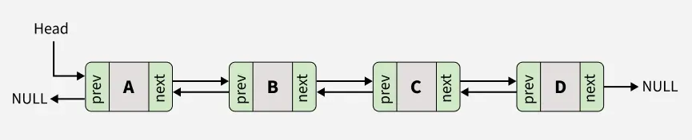

# C++ Notes: Vectors, Strings, Lists, Algorithms and Smart Pointers

# std::vector

std::vector е структура от данни в C++, която съхранява елементи от един и същи тип, подредени последователно в паметта, подобно на масив, но за разлика от него може автоматично да променя размера си по време на изпълнение на програмата.

За да можете да използвате std::vector в C++, трябва да добавите следната библиотека:
```cpp
#include <vector>
```

Общ вид на създаване на std::vector:
```cpp
std::vector<data_type> vector_name;
```
като data_type може да е примитивен тип данни, дефиниран от вас class(или struct) или дори структура от дании:
```cpp
class Student {
    int age;
};

struct Human {
    int age;
};

int main() {
    std::vector<int> vector1; // Създава вектор от цели числа
    std::vector<Student> vector2; // Създава вектор от обекти от тип Student
    std::vector<Human> vector3; // Създава вектор от обекти от тип Human
    std::vector<std::vector<int>> vector4; // Създава вектор от вектори от цели числа (двумерен масив от цели числа)
    std::vector<std::string> vector5; // Създава вектор от стрингове
}
```

std::vector може да се създава по няколко различни начина в C++:

```cpp
std::vector<int> v; // Създава празен вектор без елементи
```

```cpp
std::vector<int> v(5); // Създава вектор с 5 елемента
```

```cpp
std::vector<int> v(5, 10); // Създава вектор с 5 елемента, всички със стойност 10
```

```cpp
std::vector<int> v = {1, 2, 3, 4}; // Инициализира вектора директно с дадените стойности
```

Някои функции на std::vector:

- size - връща броя на елементите във вектора
```cpp
std::vector<int> v = {1, 2, 3};
std::println("{}", v.size()); // 3
```

- empty - проверява дали векторът е празен
```cpp
std::vector<int> v;
std::println("{}", v.empty()); // true
```

- оператор [] - достъп до елемент по индекс (като масив)
```cpp
std::vector<int> v = {10, 20, 30};
std::println("{}", v[1]); // 20
```

- push_back - добавя елемент в края
```cpp
std::vector<int> v;
v.push_back(10);
v.push_back(20);
```

- pop_back - премахва последния елемент
```cpp
std::vector<int> v = {1, 2, 3};
v.pop_back(); // маха 3
```

- clear - изтрива всички елементи
```cpp
std::vector<int> v = {1, 2, 3};
v.clear();
```

- swap - разменя съдържанието на два вектора
```cpp
std::vector<int> a = {1, 2};
std::vector<int> b = {3, 4};
a.swap(b);
```

- emplace_back - създава (конструира) елемент директно в края на вектора
```cpp
std::vector<std::pair<int, int>> v;
v.emplace_back(1, 2);
```

Материали за std::vector:
- https://cplusplus.com/reference/vector/vector/
- https://www.w3schools.com/cpp/cpp_vectors.asp
- https://www.scaler.com/topics/cpp/vector-in-cpp/


# std::string

std::string представлява динамичен низ от символи, използван за съхраняване и обработка на текст. Той автоматично управлява паметта и предоставя удобни функции за работа с текст, като добавяне, изтриване, достъп до символи и извличане на поднизове.

За да можете да използвате std::string в C++, трябва да добавите следната библиотека:
```cpp
#include <string>
```

Общ вид на създаване на std::string:
```cpp
std::string string_name;
```

std::string може да се създава по няколко различни начина в C++:

```cpp
std::string s; // празен string
```

```cpp
std::string s = "Hello"; // инициализация с текст
std::string s1("Hello"); // инициализация с текст
std::string s2 {"Hello"}; // инициализация с текст
```

Някои функции на std::string:

- size / length - връща броя на символите в низа
```cpp
std::string s = "Hello";
std::println("{}", s.size()); // 5
std::println("{}", s.length()); // 5
```

- empty - проверява дали стринг е празен
```cpp
std::string s;
std::println("{}", s.empty()); // true
```

- оператор [] - достъп до символ по индекс (като масив)
```cpp
std::string s = "Hello";
std::println("{}", s[1]); // e
```

- append / оператор += - добавя текст в края на стринга 
```cpp
std::string s1 = "Hello";
s1.append(" World"); // Hello World

std::string s2 = "Hello";
s2 += " World"; // Hello World
```

- оператор + - съединява (конкатенира) стрингове
```cpp
std::string a = "Hello";
std::string b = "World";

std::string c = a + b; // HelloWorld
```

- оператор << и оператор >> - за извеждане на string на конзолата и за въвеждане на string от конзолата 
```cpp
std::string s1{"Hello World"};
std::cout << s1; // Hello World

std::string s2;
std::cin >> s2; // !!! Чете само една дума (спира при интервал)
```

- substr - извлича част от стринг (подниз)
```cpp
s.substr(start_position, length);
start_position → от къде започва
length → колко символа да вземе (по избор)

std::string s = "Hello World";
std::string part = s.substr(6, 5); // World

// Ако няма length, взима всичко от подадената позиция до края:
std::string s = "Hello World";
std::string part = s.substr(6); // World
```

- clear - изтрива целия текст
```cpp
std::string s = "Hello";
s.clear();
```

- swap - разменя съдържанието на два стринга
```cpp
std::string a = "Hello";
std::string b = "World";

a.swap(b);
```

- push_back - добавя символ в края
```cpp
std::string s = "Worl";
s.push_back('d'); // World
```

- pop_back - премахва последния символ
```cpp
std::string s = "World";
s.pop_back(); // Worl
```

Материали за std::string:
- https://cplusplus.com/reference/string/string/


# std::list

std::list е контейнер в C++, който представлява двусвързан списък (doubly linked list). Той съхранява елементи, които не са задължително разположени последователно в паметта, а всеки елемент съдържа указател към предишния и следващия елемент в списъка.




credit: geeksforgeeks.org

За да можете да използвате std::list в C++, трябва да добавите следната библиотека:
```cpp
#include <list>
```

Общ вид на създаване std::list:
```cpp
std::list<data_type> list_name;
```

std::list може да се създава по няколко различни начина в C++:
```cpp
std::list<int> l; // Празен list
```

```cpp
std::list<int> l = {1, 2, 3}; // Инициализация със стойности
```

```cpp
std::list<int> l(5, 10); // 5 елемента със стойност 10
```

Някои функции на std::list:

- empty - проверява дали списъкът е празен
```cpp 
std::list<int> l = {1, 2, 3};
std::println("{}", l.empty()); // false
```

- size - връща броя на елементите
```cpp 
std::list<int> l = {1, 2, 3};
std::println("{}", l.size()); // 3
```

- front - достъп до първия елемент
```cpp 
std::list<int> l = {10, 20, 30};
std::println("{}", l.front()); // 10
```

- back - достъп до последния елемент
```cpp 
std::list<int> l = {10, 20, 30};
std::println("{}", l.back()); // 30
```

- push_front - добавя елемент в началото
```cpp 
std::list<int> l;
l.push_front(10); // 10
l.push_front(20); // 20 10
```

- push_back - добавя елемент в края
```cpp 
std::list<int> l;
l.push_back(10); // 10
l.push_back(20); // 10 20
```

- sort - сортира елементите
```cpp 
std::list<int> l = {3, 1, 2};
l.sort(); // 1 2 3
```

- remove - премахва всички елементи със зададена стойност
```cpp 
std::list<int> l = {1, 2, 2, 3};
l.remove(2); // 1 3
```

- reverse - обръща реда на елементите
```cpp 
std::list<int> l = {1, 2, 3};
l.reverse(); // 3 2 1
```

- clear - изтрива всички елементи
```cpp 
std::list<int> l = {1, 2, 3};
l.clear();
```

std::list не поддържа оператор [], защото елементите не са разположени последователно в паметта и не може да се изчисли директно адресът на елемент по индекс.

Един от начин да се итерира през std::list е чрез range based for loop:
```cpp
std::list<int> l = {1, 2, 3, 4};

// всеки елемент се копира в променливата x (по-бавно, защото има копиране за всеки елемент)
for (int x : l) {
   std::cout << x << " ";
}

// x е референция към оригиналния елемент, което ни позволява да правим промени по самия списък
for (int& x : l) {
   x = 0;
} // l = {0, 0 , 0}

// не прави копия, не можем да променяме елементите, удобен за четене, най-добър вариант за обхождане, когато не променяме стойностите
for (const int& x : l) {
   std::cout << x << " ";
}
```

| вариант            | копира ли | може ли да променя | скорост |
|--------------------|----------|---------------------|--------|
| `int x`            | да       | не                  | по-бавно |
| `int& x`           | не       | да                  | бързо |
| `const int& x`     | не       | не                  | бързо (най-добър за четене) |

Материали за std::list:
- https://cplusplus.com/reference/list/list/
- https://www.geeksforgeeks.org/cpp/doubly-linked-list-in-cpp/


# std::unique_ptr

std::unique_ptr е smart pointer в C++, който управлява динамично заделена памет и гарантира, че даден ресурс има само един собственик (unique ownership). Когато std::unique_ptr бъде унищожен, той автоматично освобождава паметта, което предотвратява memory leaks.

За да можете да използвате std::unique_ptr в C++, трябва да добавите следната библиотека:
```cpp
#include <memory>
```

Общ вид на създаване на std::unique_ptr за един обект:
```cpp
std::unique_ptr<data_type> p = std::make_unique<data_type>(arguments);
или
auto ptr = std::make_unique<data_type>(arguments);
```

Пример:
```cpp
class Student {
    int age;
    double grade;
public:
    Student(int _age = 0, double _grade = 0) : age(_age), grade(_grade) {}
};

int main() {
    std::unique_ptr<Student> p = std::make_unique<Student>(2, 4);
    // или
    auto p = std::make_unique<Student>(2, 4);
}
```

Общ вид на създаване на std::unique_ptr за масиви от обекти:
```cpp
std::unique_ptr<data_type[]> p = std::make_unique<data_type[]>(size);
или
auto ptr = std::make_unique<data_type[]>(size);
```

Пример:
```cpp
int main() {
    std::unique_ptr<int[]> p = std::make_unique<int[]>(4);
    // или
    auto p = std::make_unique<int[]>(4);
}
```

Някои функции на std::unique_ptr:

- get – връща суровия pointer (raw pointer)
```cpp
auto p = std::make_unique<int>(5);
int* raw = p.get();
```

- release – освобождава собствеността (НЕ изтрива паметта!)
```cpp
auto p = std::make_unique<int>(5);
int* raw = p.release(); // ти трябва да delete-неш после
```

няколко важащи само за единичнни обекти(не за масиви от обекти):

- оператор * - връща стойността, към която сочи pointer-ът
```cpp
auto p = std::make_unique<int>(5);
std::cout << *p;
```

- оператор -> - достъпва член-функции и член-данни на обекта
```cpp
auto p = std::make_unique<Student>(2, 4);
p->getAge();
```

Материали за std::unique_ptr:
- https://cplusplus.com/reference/memory/unique_ptr/


# std::shared_ptr

std::shared_ptr е smart pointer в C++, който управлява динамично заделена памет и позволява споделена собственост върху един и същ ресурс. За разлика от std::unique_ptr, при std::shared_ptr няколко указателя могат да притежават един и същ обект. Паметта се освобождава автоматично, когато последният shared_ptr, който го притежава, бъде унищожен.

За да можете да използвате std::shared_ptr в C++, трябва да добавите следната библиотека:
```cpp
#include <memory>
```

Общ вид на създаване на std::shared_ptr за един обект:
```cpp
std::shared_ptr<data_type> p = std::make_shared<data_type>(arguments);
или
auto p = std::make_shared<data_type>(arguments);
```

Пример:
```cpp
class Student {
    int age;
    double grade;
public:
    Student(int _age = 0, double _grade = 0) : age(_age), grade(_grade) {}
};

int main() {
    std::shared_ptr<Student> p = std::make_shared<Student>(2, 4);
    // или
    auto p = std::make_shared<Student>(2, 4);
}
```

Някои функции на std::unique_ptr:

- get – връща суровия pointer (raw pointer)
```cpp
auto p = std::make_shared<int>(5);
int* raw = p.get();
```

- use_count – брой собственици
```cpp
auto p1 = std::make_shared<int>(10);
auto p2 = p1;

std::cout << p1.use_count(); // 2
```

- оператор * - връща стойността, към която сочи pointer-ът
```cpp
auto p = std::make_shared<int>(5);
std::cout << *p;
```

- оператор -> - достъпва член-функции и член-данни на обекта
```cpp
auto p = std::make_shared<Student>(2, 4);
p->getAge();
```

Материали за std::shared_ptr:
- https://cplusplus.com/reference/memory/shared_ptr/


# std::weak_ptr

std::weak_ptr е smart pointer в C++, който наблюдава обект, управляван от std::shared_ptr, без да увеличава броя на собствениците. Той НЕ притежава ресурса и се използва основно за разбиване на циклични зависимости (circular references).

За да можете да използвате std::weak_ptr в C++, трябва да добавите следната библиотека:
```cpp
#include <memory>
```

Създаване на std::weak_ptr от std::shared_ptr:
```cpp
std::shared_ptr<int> sp = std::make_shared<int>(10);
std::weak_ptr<int> wp = sp;
```

Някои функции на std::weak_ptr:

- use_count – колко shared_ptr има
```cpp
auto sp = std::make_shared<int>(10);
std::weak_ptr<int> wp = sp;

std::cout << wp.use_count(); // 1
```

Материали за std::weak_ptr:
- https://cplusplus.com/reference/memory/weak_ptr/


# algorithm

За да можете да използвате функциите от algorithm, трябва да добавите следната библиотека:
```cpp
#include <algorithm>
```

Някои функции:

- sort()
```cpp
std::vector<int> v = {2, 0, 6};
std::sort(v.begin(), v.end()); // 0 2 6
```

- reverse()
```cpp
std::vector<int> v = {2, 0, 6};
std::reverse(v.begin(), v.end()); // 6 0 2
```

begin() връща итератор към първия елемент, end() връща итератор към позиция СЛЕД последния елемент (НЕ към реален елемент).

Материали за algorithm:
- https://cplusplus.com/reference/algorithm/

# Задачи

## 1. Simple Contact List

Да се създаде клас Contact със следните член-данни и член-функции:

член-данни:
- name
- phone

член-функции:
- default конструктор
- конструктор с параметри

Да се създаде клас Contact със следните член-данни и член-функции:

член-данни:
- масив от контакти

член-функции:
- addContact - приема нов контакт и го добавя накрая на масива с контакти
- findContact - приема име на контакт, търси дали съществува такъв контакт в масива, ако съществува извежда името и телефонния номер на контакта, в противен случай извежда подходящо съобщение 
- printAll - принтира всички контакти в масива 

<details>
<summary>Решение</summary>

```cpp
#include <print>
#include <vector>
#include <string>

constexpr std::string DEFAULT_NAME = "NO_NAME";
constexpr std::string DEFAULT_PHONE = "NO_PHONE";

class Contact {
    std::string name;
    std::string phone;

public:
    Contact() : name(DEFAULT_NAME), phone(DEFAULT_PHONE) {}

    Contact(const std::string& _name, const std::string& _phone) : name(_name), phone(_phone) {}

    const std::string& getName() const {
        return this->name;
    }

    const std::string& getPhone() const {
        return this->phone;
    }
};

class ContactList {
    std::vector<Contact> contacts;

public:
    void addContact(const Contact& newContact) {
        contacts.push_back(newContact);
    }

    void findContact(const std::string& name) const {
        for (size_t i = 0; i < contacts.size(); i++) {
            if (contacts[i].getName() == name) {
                println("name: {}   phone: {}", contacts[i].getName(), contacts[i].getPhone());
                return;
            }
        }

        println("Contact with the given name was not found!");
    }

    void printAll() const {
        if (contacts.size() == 0) {
            println("No contacts!");
            return;
        }

        for (size_t i = 0; i < contacts.size(); i++) {
            println("name: {}   phone: {}", contacts[i].getName(), contacts[i].getPhone());
        }
    }
};

```

</details>


## 2. Number List

Да се създаде клас Number List със следните член-данни и член-функции:

член-данни:
- масив от цели числа

член-функции:
- addNum - добавя цяло число в края на масива
- sortAscending - сортира числата в възходящ ред
- sortDescending - сортира числата в низходящ ред
- printAll - извежда всички числа, разделени с интервал

<details>
<summary>Решение</summary>

```cpp
#include <print>
#include <vector>
#include <algorithm>

class NumberList {
    std::vector<int> numbers;

public:
    void addNum(int num) {
        numbers.push_back(num);
    }

    void sortAscending() {
        std::sort(numbers.begin(), numbers.end());
    }

    void sortDescending() {
        std::sort(numbers.begin(), numbers.end(), std::greater<int>());
        
        // алтернатвивно може и така:
        // sortAscending();
        // std::reverse(numbers.begin(), numbers.end());
        // не е най-доброто решение, но работи
    }

    void printAll() const {
        for (const int& x : numbers)
            print("{} ", x);
    }
};
```
</details>

## 3. Simple box

Да се създаде клас Box със следните член-данни и член-функции:

член-данни:
- weight

член-функции:
- default конструктор и конструктор с параметри (слети заедно)

В main:
- създай Box simpleBox с начална тежест 0 (**един собственик**)
- смени weight на simpleBox на 3.14
- принтирай weight на simpleBox

<details>
<summary>Решение</summary>

```cpp
#include <print>
#include <memory>

constexpr double DEFAULT_WEIGHT = 0;

class Box {
    double weight;

public:
    Box(double _weight = DEFAULT_WEIGHT) : weight(_weight) {}

    void setWeight(double _weight) {
        if (_weight < 0)
            return;

        weight = _weight;
    }

    double getWeight() const {
        return weight;
    }
};

int main() {
    std::unique_ptr<Box> simpleBox = std::make_unique<Box>(0);
    simpleBox->setWeight(3.14);
    println("{}", simpleBox->getWeight());
}
```
</details>

## 4. Shared Book

Да се създаде клас Book със следните член-данни и член-функции:

член-данни:
- title

член-функции:
- default конструктор и конструктор с параметри (слети заедно)

В main:
- създай Book book1 със заглавие "Winnie-the-Pooh" (**споделена собственост**)
- създай Book book2 да "споделя" book1
- изведи колко собственика споделят ресурса
- промени title през book2 на "Little Red Riding Hood"
- провери дали заглавието на book1 също се е променило

<details>
<summary>Решение</summary>

```cpp
#include <print>
#include <string>
#include <memory>

constexpr std::string DEFAULT_TITLE = "NO_TITLE";

class Book {
    std::string title;

public:
    Book(const std::string& _title = DEFAULT_TITLE) : title(_title) {}

    void setTitle(const std::string& _title) {
        title = _title;
    }

    const std::string& getTitle() const {
        return title;
    }
};

int main() {
    std::shared_ptr<Book> book1 = std::make_shared<Book>("Winnie-the-Pooh");
    std::shared_ptr<Book> book2 = book1;

    println("{}", book1.use_count());

    book2->setTitle("Little Red Riding Hood");
    println("{}", book2->getTitle());
    println("{}", book1->getTitle());
}
```
</details>