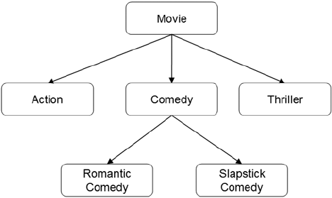
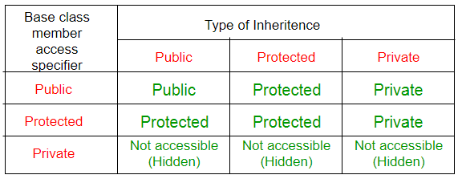
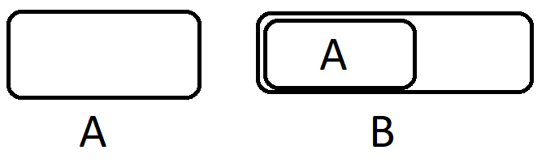

# Наследяване в C++

---

## Съдържание

1. [Какво е наследяване?](#1-какво-е-наследяване)
2. [Терминология и видове](#2-терминология-и-видове)
3. [Видове наследяване — видимост](#3-видове-наследяване--видимост)
4. [Наследяване vs. Композиция](#4-наследяване-vs-композиция)
5. [Конструктори и деструктори при наследяване](#5-конструктори-и-деструктори-при-наследяване)
6. [Копиране при наследяване](#6-копиране-при-наследяване)
7. [Move семантика при наследяване](#7-move-семантика-при-наследяване)
8. [Rule of Zero при наследяване](#8-rule-of-zero-при-наследяване)
9. [Подаване като параметри — указатели и референции](#9-подаване-като-параметри--указатели-и-референции)
10. [Edge Cases и капани](#10-edge-cases-и-капани)
11. [Обобщение](#11-обобщение)

---

## Основни дефиниции

> **Наследяване** — механизъм за създаване на нов клас, базиран на съществуващ. Новият клас автоматично получава член-данните и методите на съществуващия.

> **Base class (базов клас / родителски клас)** — класът, от който се наследява.

> **Derived class (наследен клас / дъщерен клас)** — класът, който наследява от базовия.

> **Is-a връзка** — семантичната основа на наследяването. `Circle is-a Shape`, `Dog is-a Animal`. Ако нямаш is-a връзка — наследяването не е правилният инструмент.

> **Обект от наследен клас** — съдържа вградена копия на базовия обект плюс собствените си данни.

---

## 1. Какво е наследяване?

Когато два класа споделят обща функционалност, вместо да се дублира кодът — единият наследява другия.

### Без наследяване — дублиран код

```cpp
class Dog {
    std::string name;
    int         age;
public:
    Dog(const std::string& n, int a) : name(n), age(a) {}
    void eat()   { std::cout << name << " яде\n"; }
    void sleep() { std::cout << name << " спи\n"; }
    void bark()  { std::cout << name << " лае\n"; }
};

class Cat {
    std::string name;   // ← дублирано
    int         age;    // ← дублирано
public:
    Cat(const std::string& n, int a) : name(n), age(a) {}
    void eat()   { std::cout << name << " яде\n"; }   // ← дублирано
    void sleep() { std::cout << name << " спи\n"; }   // ← дублирано
    void meow()  { std::cout << name << " мяука\n"; }
};
```

### С наследяване — общото е на едно място

```cpp
class Animal {
    std::string name;
    int         age;
public:
    Animal(const std::string& n, int a) : name(n), age(a) {}
    void eat()   { std::cout << name << " яде\n"; }
    void sleep() { std::cout << name << " спи\n"; }
    const std::string& getName() const { return name; }
};

class Dog : public Animal {
public:
    Dog(const std::string& n, int a) : Animal(n, a) {}
    void bark() { std::cout << getName() << " лае\n"; }
};

class Cat : public Animal {
public:
    Cat(const std::string& n, int a) : Animal(n, a) {}
    void meow() { std::cout << getName() << " мяука\n"; }
};

int main() {
    Dog d("Рекс", 3);
    Cat c("Мици", 5);

    d.eat();    // наследено от Animal
    d.sleep();  // наследено от Animal
    d.bark();   // собствено на Dog

    c.eat();    // наследено от Animal
    c.meow();   // собствено на Cat
}
```

---

## 2. Терминология и видове

### Структурата в паметта

При наследяване обектът от наследения клас **съдържа вграден обект** от базовия клас:

```
Обект от тип Animal (A):         Обект от тип Dog (B наследява A):

┌──────────────┐                  ┌──────────────┐
│   name       │                  │   name       │  ← частта от Animal
│   age        │                  │   age        │
└──────────────┘                  ├──────────────┤
                                  │  (Dog данни) │  ← собствените на Dog
                                  └──────────────┘
```

Базовата част винаги е **първа** в паметта.

### Class Hierarchy (йерархия на класовете)





### Видове наследяване по структура

**Single (единично)** — клас наследява от точно един базов клас:

```cpp
class Animal { };
class Dog : public Animal { };   // Dog наследява само Animal
```

**Multiple (множествено)** — клас наследява от два или повече базови класа:

```cpp
class Flyable  { public: void fly()  {} };
class Swimmable{ public: void swim() {} };

class Duck : public Flyable, public Swimmable {
    // Duck може и да лети, и да плува
};
```

---

## 3. Видове наследяване — видимост

При наследяване достъпът до членовете на базовия клас зависи от **вида на наследяването**.



### Таблица на видимостта

```
┌──────────────────┬──────────────┬───────────────┬───────────────┐
│ Член в Base      │ public       │ protected     │ private       │
│                  │ наследяване  │ наследяване   │ наследяване   │
├──────────────────┼──────────────┼───────────────┼───────────────┤
│ public           │ public       │ protected     │ private       │
│ protected        │ protected    │ protected     │ private       │
│ private          │ недостъпен   │ недостъпен    │ недостъпен    │
└──────────────────┴──────────────┴───────────────┴───────────────┘
```

`private` членовете на базовия клас **никога** не са достъпни директно от наследения клас — независимо от вида наследяване.

### Пример

```cpp
class Base {
public:
    int x = 1;
protected:
    int y = 2;
private:
    int z = 3;
};

class PublicDerived : public Base {
    void f() {
        x = 10;   // ✅ x остава public
        y = 20;   // ✅ y остава protected
        // z = 30; ← ❌ private — недостъпен
    }
};

class ProtectedDerived : protected Base {
    void f() {
        x = 10;   // ✅ x става protected
        y = 20;   // ✅ y остава protected
        // z = 30; ← ❌ недостъпен
    }
};

class PrivateDerived : private Base {
    void f() {
        x = 10;   // ✅ x става private
        y = 20;   // ✅ y става private
        // z = 30; ← ❌ недостъпен
    }
};

int main() {
    PublicDerived    pd;
    ProtectedDerived cd;

    pd.x = 5;   // ✅ x е public в PublicDerived
    // cd.x = 5; ← ❌ x е protected в ProtectedDerived
}
```

### Кога се ползва кое

```
public наследяване    → is-a връзка (Dog is-a Animal)    ← най-честото
protected наследяване → рядко, скрива интерфейса от external код
private наследяване   → implemented-in-terms-of (без is-a)
```

---

## 4. Наследяване vs. Композиция

| | Наследяване | Композиция |
|---|---|---|
| Връзка | is-a (куче **е** животно) | has-a (кола **има** двигател) |
| Достъп | `public` и `protected` членове | само `public` интерфейс |
| Дефинирано | по време на компилация | по време на изпълнение |
| Промяна | трудна — промяна в базовия засяга всички | лесна — подменяш вътрешния обект |

```cpp
// ✅ Наследяване — is-a:
class Shape   { };
class Circle  : public Shape { };  // Circle IS-A Shape

// ✅ Композиция — has-a:
class Engine  { };
class Car {
    Engine engine;  // Car HAS-A Engine
};

// ❌ Грешна употреба на наследяване:
class Stack : public std::vector<int> {
    // Stack НЕ е вектор — той само използва вектор
    // Правилно: Stack да съдържа vector като член
};
```

---

## 5. Конструктори и деструктори при наследяване

### Ред на изпълнение

При създаване на обект от наследен клас:
1. Изпълнява се конструкторът на **базовия** клас
2. Изпълнява се конструкторът на **наследения** клас

При унищожаване — в **обратен ред**:
1. Деструкторът на **наследения** клас
2. Деструкторът на **базовия** клас

```cpp
class Base {
public:
    Base()  { std::cout << "Base()\n"; }
    ~Base() { std::cout << "~Base()\n"; }
};

class Derived : public Base {
public:
    Derived()  { std::cout << "Derived()\n"; }
    ~Derived() { std::cout << "~Derived()\n"; }
};

int main() {
    Derived d;
}
// Изход:
// Base()       ← 1. първо базовият
// Derived()    ← 2. после наследеният
// ~Derived()   ← 3. обратно: първо наследеният
// ~Base()      ← 4. после базовият
```





### Извикване на конструктор на базовия клас

В initialization list-а на наследения клас **трябва** изрично да се укаже кой конструктор на базовия клас да се извика. Ако не е указано — извиква се конструкторът по подразбиране:

```cpp
class Animal {
    std::string name;
    int         age;
public:
    Animal() : name("Unknown"), age(0) {}
    Animal(const std::string& n, int a) : name(n), age(a) {}
};

class Dog : public Animal {
    std::string breed;
public:
    // ✅ Изрично извикване на конструктора на Animal:
    Dog(const std::string& n, int a, const std::string& b)
        : Animal(n, a),   // ← задължително в initialization list
          breed(b) {}

    // Без Animal(n, a) → извиква се Animal() по подразбиране
    // name = "Unknown", age = 0 дори да сме подали аргументи!
};
```

### При динамична памет — всеки деструктор освобождава своето

```cpp
class Base {
    char* data;
public:
    Base(const char* d) {
        data = new char[strlen(d) + 1];
        strcpy(data, d);
    }
    ~Base() {
        delete[] data;   // ← освобождава само data на Base
    }
};

class Derived : public Base {
    char* extra;
public:
    Derived(const char* d, const char* e) : Base(d) {
        extra = new char[strlen(e) + 1];
        strcpy(extra, e);
    }
    ~Derived() {
        delete[] extra;  // ← освобождава само extra на Derived
        // ~Base() се извиква автоматично след това
    }
};
```

---

## 6. Копиране при наследяване

### Проблемът

Ако наследеният клас дефинира copy конструктор или `operator=` без да извика базовите версии, **базовата част не се копира**:

```cpp
class Base {
    std::string name;
public:
    Base(const std::string& n) : name(n) {}
    Base(const Base& other) : name(other.name) {
        std::cout << "Base copy\n";
    }
};

class Derived : public Base {
    int value;
public:
    Derived(const std::string& n, int v) : Base(n), value(v) {}

    // ❌ Грешно — не копира базовата част:
    Derived(const Derived& other) : value(other.value) {
        // Base частта се инициализира с Base() по подразбиране!
    }

    // ✅ Правилно — изрично копиране на базовата част:
    Derived(const Derived& other) : Base(other),   // ← copy constructor на Base
                                    value(other.value) {
        std::cout << "Derived copy\n";
    }
};
```

### Copy `operator=` при наследяване

```cpp
class Base {
    std::string name;
public:
    Base& operator=(const Base& other) {
        if (this != &other)
            name = other.name;
        return *this;
    }
};

class Derived : public Base {
    int value;

    void copyFrom(const Derived& other) {
        value = other.value;
    }

public:
    Derived& operator=(const Derived& other) {
        if (this != &other) {
            Base::operator=(other);   // ← изрично извикване на базовия op=
            copyFrom(other);
        }
        return *this;
    }
};
```

### Ако НЕ дефинираш copy операциите в наследения клас

Компилаторът ги генерира автоматично и извиква базовите версии — **това е правилното поведение** ако наследеният клас не управлява собствени ресурси:

```cpp
class Animal {
    std::string name;   // std::string управлява паметта
public:
    Animal(const std::string& n) : name(n) {}
    // Copy конструктор и op= — генерирани правилно от компилатора
};

class Dog : public Animal {
    std::string breed;  // std::string управлява паметта
public:
    Dog(const std::string& n, const std::string& b)
        : Animal(n), breed(b) {}
    // ✅ Rule of Zero — не дефинираме нищо
    // Компилаторът генерира copy/move операции,
    // извикващи Animal::copy и std::string::copy
};
```

---

## 7. Move семантика при наследяване

### Move конструктор

```cpp
class Base {
    char* data;
public:
    Base(Base&& other) noexcept : data(other.data) {
        other.data = nullptr;
    }
};

class Derived : public Base {
    char* extra;
public:
    Derived(Derived&& other) noexcept
        : Base(std::move(other)),   // ← std::move задължително!
          extra(other.extra) {
        other.extra = nullptr;
    }
};
```

### Защо `std::move` е задължителен при делегирането

`other` е именувана rvalue референция — вътре в тялото на функцията е **lvalue**. Без `std::move` би се извикал copy конструкторът на `Base` вместо move:

```cpp
Derived(Derived&& other) noexcept
    : Base(other),              // ❌ other е lvalue → copy constructor на Base!
      extra(other.extra) {}

Derived(Derived&& other) noexcept
    : Base(std::move(other)),   // ✅ std::move → move constructor на Base
      extra(other.extra) {}
```

### Move `operator=`

```cpp
class Base {
    char* data;
public:
    Base& operator=(Base&& other) noexcept {
        if (this != &other) {
            delete[] data;
            data       = other.data;
            other.data = nullptr;
        }
        return *this;
    }
};

class Derived : public Base {
    char* extra;
public:
    Derived& operator=(Derived&& other) noexcept {
        if (this != &other) {
            Base::operator=(std::move(other));   // ← изрично, с std::move
            delete[] extra;
            extra       = other.extra;
            other.extra = nullptr;
        }
        return *this;
    }
};
```

### Пълен пример — Rule of Five при наследяване

```cpp
#include <iostream>
#include <cstring>

class Animal {
    char* name;
public:
    Animal(const char* n) {
        name = new char[strlen(n) + 1];
        strcpy(name, n);
    }

    // Copy
    Animal(const Animal& other) {
        name = new char[strlen(other.name) + 1];
        strcpy(name, other.name);
    }
    Animal& operator=(const Animal& other) {
        if (this != &other) {
            delete[] name;
            name = new char[strlen(other.name) + 1];
            strcpy(name, other.name);
        }
        return *this;
    }

    // Move
    Animal(Animal&& other) noexcept : name(other.name) {
        other.name = nullptr;
    }
    Animal& operator=(Animal&& other) noexcept {
        if (this != &other) {
            delete[] name;
            name       = other.name;
            other.name = nullptr;
        }
        return *this;
    }

    ~Animal() { delete[] name; }

    const char* getName() const { return name ? name : ""; }
};

class Dog : public Animal {
    char* breed;
public:
    Dog(const char* n, const char* b) : Animal(n) {
        breed = new char[strlen(b) + 1];
        strcpy(breed, b);
    }

    // Copy
    Dog(const Dog& other) : Animal(other) {   // ← copy на Animal
        breed = new char[strlen(other.breed) + 1];
        strcpy(breed, other.breed);
    }
    Dog& operator=(const Dog& other) {
        if (this != &other) {
            Animal::operator=(other);   // ← copy op= на Animal
            delete[] breed;
            breed = new char[strlen(other.breed) + 1];
            strcpy(breed, other.breed);
        }
        return *this;
    }

    // Move
    Dog(Dog&& other) noexcept : Animal(std::move(other)),   // ← move на Animal
                                 breed(other.breed) {
        other.breed = nullptr;
    }
    Dog& operator=(Dog&& other) noexcept {
        if (this != &other) {
            Animal::operator=(std::move(other));   // ← move op= на Animal
            delete[] breed;
            breed       = other.breed;
            other.breed = nullptr;
        }
        return *this;
    }

    ~Dog() { delete[] breed; }

    void print() const {
        std::cout << getName() << " (" << (breed ? breed : "") << ")\n";
    }
};

int main() {
    Dog d1("Рекс", "Овчарка");
    Dog d2 = d1;                   // copy constructor
    Dog d3 = std::move(d1);        // move constructor

    d3.print();   // Рекс (Овчарка)
    d1.print();   // "" — d1 е "ограбен"
}
```

---

## 8. Rule of Zero при наследяване

Ако **базовият клас** и **наследеният клас** управляват ресурсите си чрез STL типове (`std::string`, `std::vector`, `unique_ptr`), компилаторът генерира всички специални функции правилно — включително базовите версии:

```cpp
// ✅ Rule of Zero — нищо не се дефинира ръчно
class Animal {
    std::string name;   // std::string управлява паметта
    int         age;
public:
    Animal(const std::string& n, int a) : name(n), age(a) {}
    // Деструктор, copy, move — всичко генерирано правилно
};

class Dog : public Animal {
    std::string breed;
public:
    Dog(const std::string& n, int a, const std::string& b)
        : Animal(n, a), breed(b) {}
    // ✅ Компилаторът генерира:
    //   Dog(const Dog&)  → извиква Animal(const Animal&) + string copy
    //   Dog(Dog&&)       → извиква Animal(Animal&&) + string move
    //   operator=        → извиква Animal::op= + string op=
    //   ~Dog             → извиква ~Animal автоматично
};

int main() {
    Dog d1("Рекс", 3, "Овчарка");
    Dog d2 = d1;              // ✅ deep copy — всичко правилно
    Dog d3 = std::move(d1);   // ✅ move — всичко правилно
}
```

### Кога Rule of Zero НЕ е достатъчен

Ако наследеният клас добавя собствена динамична памет (`char*`, `int*`) — трябва Rule of Five само за наследения клас, а базовият може да остане с Rule of Zero:

```cpp
class Animal {
    std::string name;   // Rule of Zero за Animal
public:
    Animal(const std::string& n) : name(n) {}
};

class Dog : public Animal {
    char* breed;        // ← ръчна памет → Rule of Five за Dog

    void copyFrom(const Dog& other) {
        breed = new char[strlen(other.breed) + 1];
        strcpy(breed, other.breed);
    }
    void free() { delete[] breed; breed = nullptr; }

public:
    Dog(const std::string& n, const char* b) : Animal(n) {
        breed = new char[strlen(b) + 1];
        strcpy(breed, b);
    }
    Dog(const Dog& other)  : Animal(other) { copyFrom(other); }
    Dog(Dog&& other) noexcept : Animal(std::move(other)), breed(other.breed) {
        other.breed = nullptr;
    }
    Dog& operator=(const Dog& other) {
        if (this != &other) { Animal::operator=(other); free(); copyFrom(other); }
        return *this;
    }
    Dog& operator=(Dog&& other) noexcept {
        if (this != &other) {
            Animal::operator=(std::move(other));
            free();
            breed = other.breed; other.breed = nullptr;
        }
        return *this;
    }
    ~Dog() { free(); }
};
```

---

## 9. Подаване като параметри — указатели и референции

Наследен клас може да се подаде навсякъде, където се очаква базов клас. Обратното не е вярно.

### Какво приема Base и какво приема само Derived

```
f1(Base b)          ┐
f2(const Base&)     ├── приемат и Base, и Derived
f3(const Base*)     ┘   (защото Derived стои на Base)

g1(Der d)           ┐
g2(Der&)            ├── приемат САМО Derived
g3(Der*)            ┘
```

```cpp
class Base { };
class Derived : public Base { };

void f1(Base b)         { }   // приема Base и Derived (по стойност → slicing при Derived!)
void f2(const Base& b)  { }   // приема Base и Derived (без slicing)
void f3(const Base* b)  { }   // приема Base* и Derived* (без slicing)

void g1(Derived d)      { }   // само Derived
void g2(Derived& d)     { }   // само Derived
void g3(Derived* d)     { }   // само Derived

Base    b;
Derived d;

f1(b);   // ✅
f1(d);   // ✅ но внимание — slicing! (копира само Base частта)
f2(b);   // ✅
f2(d);   // ✅ Няма slicing, защото няма копиране.
f3(&b);  // ✅
f3(&d);  // ✅ Derived* конвертира към Base* автоматично

g1(d);   // ✅ само Derived
g2(d);   // ✅ само Derived
g3(&d);  // ✅ само Derived
// g1(b); g2(b); g3(&b);  ← ❌ Base не е Derived
```

### По референция

```cpp
class Animal {
public:
    std::string name;
    void eat() { std::cout << name << " яде\n"; }
};

class Dog : public Animal {
public:
    void bark() { std::cout << name << " лае\n"; }
};

void feedAnimal(Animal& a) {
    a.eat();       // ✅ работи с Animal и Dog
    // a.bark();   // ❌ Animal не знае за bark()
}

int main() {
    Animal a; a.name = "Котка";
    Dog    d; d.name = "Рекс";

    feedAnimal(a);   // ✅
    feedAnimal(d);   // ✅ Dog is-a Animal
}
```

### По указател

```cpp
void processAnimal(const Animal* a) {
    if (a)
        a->eat();
}

Dog d; d.name = "Рекс";
processAnimal(&d);   // ✅ Dog* конвертира към Animal* автоматично
```

### Масив от указатели — хетерогенна колекция

```cpp
Animal* animals[3];
animals[0] = new Animal();
animals[1] = new Dog();
animals[2] = new Dog();

for (int i = 0; i < 3; i++) {
    animals[i]->eat();
    delete animals[i];
}
```

### Масив от Derived — не може да се подаде като масив от Base

```cpp
void f(const Base* arr, int size) {
    for (int i = 0; i < size; i++)
        arr[i].someMethod();   // ❌ Проблем!
}

Derived arr[3];
f(arr, 3);   // ❌ НЕ трябва!
```

Причината: `arr[i]` се изчислява като `*(arr + i)` — компилаторът добавя `i * sizeof(Base)` към адреса. Но елементите в масива са `Derived` — с размер `sizeof(Derived) > sizeof(Base)`. Резултатът е, че `arr[1]` не сочи към втория `Derived`, а към произволна памет в средата на първия:

```
Масив от Derived:
┌──────────────────┬──────────────────┬──────────────────┐
│   Derived[0]     │   Derived[1]     │   Derived[2]     │
│ [Base|Derived]   │ [Base|Derived]   │ [Base|Derived]   │
└──────────────────┴──────────────────┴──────────────────┘

f(arr, 3) го чете като масив от Base:
arr[0] = ✅ начало на Derived[0]
arr[1] = ❌ sizeof(Base) байта след arr[0] → в средата на Derived[0]!
arr[2] = ❌ в средата на Derived[1]!
```

**Решението** — масив от указатели:

```cpp
void f(const Base** arr, int size) {
    for (int i = 0; i < size; i++)
        arr[i]->someMethod();   // ✅ всеки указател е с правилния размер
}

Derived d1, d2, d3;
const Base* arr[] = { &d1, &d2, &d3 };
f(arr, 3);   // ✅
```

### Slicing проблем — подаване по стойност

При подаване **по стойност** наследеният обект се **нарязва** — копира се само базовата част:

```cpp
void process(Animal a) {      // ← по стойност!
    a.eat();
}

Dog d; d.name = "Рекс";
process(d);   // ❌ Slicing! Dog се копира като Animal
              // Dog-специфичните данни се губят
```

```
Dog d:          Копието в process():
┌──────────┐    ┌──────────┐
│  name    │    │  name    │   ← само Animal частта
│  age     │    │  age     │
├──────────┤    └──────────┘   ← Dog данните изчезват!
│  breed   │
└──────────┘
```

**Решението:** Винаги подавай по **референция или указател** когато работиш с йерархии:

```cpp
void process(const Animal& a) { a.eat(); }   // ✅ без slicing
void process(const Animal* a) { a->eat(); }  // ✅ без slicing
```

---

## 10. Edge Cases и капани

### Slicing при присвояване

```cpp
Dog d("Рекс", 3, "Овчарка");
Animal a = d;   // ❌ Slicing — a съдържа само Animal частта на d

// ✅ Работи правилно само с указатели/референции:
Animal& ref = d;   // ✅ ref гледа целия Dog обект
Animal* ptr = &d;  // ✅ ptr сочи към целия Dog обект
```

---

### Забравено извикване на базовия copy/move

```cpp
class Derived : public Base {
    int value;
public:
    // ❌ Не извиква Base copy constructor:
    Derived(const Derived& other) : value(other.value) {}
    // Base частта се инициализира с Base() — данните на Base се губят!

    // ✅ Правилно:
    Derived(const Derived& other) : Base(other), value(other.value) {}
};
```

---

### Move без `std::move` при делегиране

```cpp
class Derived : public Base {
    char* extra;
public:
    Derived(Derived&& other) noexcept
        : Base(other),              // ❌ other е lvalue → COPY на Base!
          extra(other.extra) {
        other.extra = nullptr;
    }

    Derived(Derived&& other) noexcept
        : Base(std::move(other)),   // ✅ move на Base
          extra(other.extra) {
        other.extra = nullptr;
    }
};
```

---

### Деструкторът на базовия клас и динамично заделени обекти

```cpp
class Base {
public:
    ~Base() { std::cout << "~Base\n"; }   // НЕ е virtual!
};

class Derived : public Base {
    char* data;
public:
    Derived() { data = new char[100]; }
    ~Derived() {
        delete[] data;
        std::cout << "~Derived\n";
    }
};

Base* ptr = new Derived();
delete ptr;   // ❌ Извиква само ~Base()!
              //    ~Derived() не се извиква → data изтича!
```

Решението е `virtual` деструктор — тема от полиморфизма:

```cpp
class Base {
public:
    virtual ~Base() {}   // ✅ virtual → правилното унищожаване
};
```

---

### Грешна употреба на наследяване вместо композиция

```cpp
// ❌ Stack НЕ е vector — не трябва да наследява:
class Stack : public std::vector<int> {
    // Проблем: излага push_back, insert, operator[] — неща, 
    // които Stack не трябва да позволява
};

// ✅ Stack HAS-A vector — правилно с композиция:
class Stack {
    std::vector<int> data;
public:
    void push(int x)  { data.push_back(x); }
    int  pop()        { int t = data.back(); data.pop_back(); return t; }
    int  top()  const { return data.back(); }
    bool empty() const{ return data.empty(); }
};
```

---

### Множествено наследяване — Diamond Problem Ще го видим по нататък

```cpp
class A { public: int x = 0; };
class B : public A { };
class C : public A { };
class D : public B, public C { };   // ❌ Diamond!

D d;
d.x = 5;   // ❌ Двусмислено — B::A::x или C::A::x?
d.B::x = 5;   // трябва изрично
```

Решението — `virtual` наследяване:

```cpp
class B : virtual public A { };
class C : virtual public A { };
class D : public B, public C { };   // ✅ само едно A в D

D d;
d.x = 5;   // ✅ без двусмислие
```

---

## 11. Обобщение

### Ред на конструиране и унищожаване

```
Конструиране:                    Унищожаване:
Base()                           ~Derived()
  ↓                                ↓
Derived()                        ~Base()
```

### Copy и Move при наследяване

```
                        Copy конструктор    Move конструктор
Базов клас в init list: Base(other)         Base(std::move(other))
Базов op= в тялото:     Base::operator=(o)  Base::operator=(std::move(o))
```

### Rule of Zero vs Rule of Five

```
Членове само от STL (string, vector, unique_ptr):
  → Rule of Zero — компилаторът генерира всичко правилно

Наследен клас с ръчна памет (char*, int*):
  → Rule of Five за наследения клас
  → Базовият може да остане Rule of Zero
  → Задължително: Base(other) и Base::operator=(other) в copy
  → Задължително: Base(std::move(other)) и Base::operator=(std::move(other)) в move
```

### Правила

```
✅ Подавай по референция/указател — избягва slicing
✅ В copy конструктора на Derived: Base(other) в initialization list
✅ В copy op= на Derived: Base::operator=(other) в тялото
✅ В move конструктора на Derived: Base(std::move(other))
✅ В move op= на Derived: Base::operator=(std::move(other))
✅ Ако Derived не добавя ресурси — Rule of Zero е достатъчен
✅ Деструкторът на Base трябва да е virtual при полиморфна употреба

❌ Подаване по стойност → slicing (базовата частта се копира, останалото се губи)
❌ Забравен Base(other) в copy → базовата част не се копира
❌ std::move(other) без std::move при делегиране → copy вместо move
❌ Наследяване вместо композиция при has-a → нарушен дизайн
❌ Diamond Problem без virtual наследяване → двусмислие
```

> **Основен извод:** Наследяването моделира is-a връзка и позволява повторно използване на код. При копиране и местене базовата част трябва изрично да се обработва. Rule of Zero работи когато всички член-данни в йерархията са от STL типове. Подаването по стойност причинява slicing — при работа с йерархии винаги се използват референции или указатели.