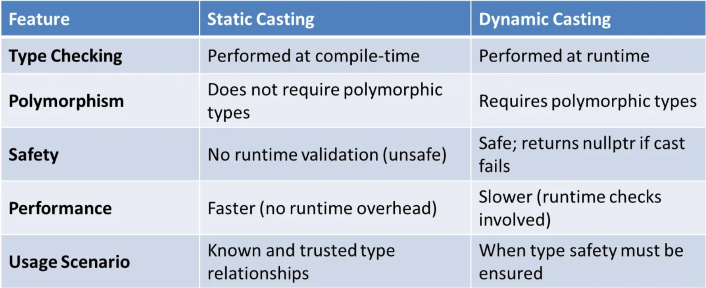

# Полиморфизъм и Динамично Свързване в C++

---

## Съдържание

1. [Статично vs. Динамично свързване](#1-статично-vs-динамично-свързване)
2. [Виртуални функции](#2-виртуални-функции)
3. [Виртуална таблица — vTable и vPtr](#3-виртуална-таблица--vtable-и-vptr)
4. [Полиморфизъм](#4-полиморфизъм)
5. [Виртуален деструктор и Rule of Zero](#5-виртуален-деструктор-и-rule-of-zero)
6. [Абстрактни класове и интерфейси](#6-абстрактни-класове-и-интерфейси)
7. [`override` и `final`](#7-override-и-final)
8. [Type Casting](#8-type-casting)
9. [Factory Design Pattern](#9-factory-design-pattern)
10. [Observer Design Pattern](#10-observer-design-pattern)
11. [Edge Cases и капани](#11-edge-cases-и-капани)
12. [Обобщение](#12-обобщение)

---

## Основни дефиниции

> **Статично свързване (Early binding)** — изборът на функция се извършва **по време на компилация**. Компилаторът знае точно коя функция да извика.

> **Динамично свързване (Late binding)** — изборът на функция се извършва **по време на изпълнение**, чрез виртуалната таблица.

> **Виртуална функция** — член-функция, декларирана с `virtual` в базовия клас. Позволява на наследниците да я предефинират, а на извикването чрез `Base*` да се реши по runtime типа.

> **Абстрактен клас** — клас с поне една чисто виртуална функция (`= 0`). Не могат да се създават обекти от него директно.

> **Полиморфизъм** — едно и също действие се реализира по различен начин в зависимост от типа на обекта.

---

## 1. Статично vs. Динамично свързване

### Проблемът без `virtual`

```cpp
class Animal {
public:
    void speak() const {
        std::cout << "Животно издава звук\n";
    }
};

class Dog : public Animal {
public:
    void speak() const {
        std::cout << "Куче лае: Бау!\n";
    }
};

void makeSpeak(const Animal& a) {
    a.speak();   // компилаторът решава тук по типа на параметъра — Animal&
}

int main() {
    Dog dog;
    makeSpeak(dog);   // "Животно издава звук" ← ГРЕШНО!
                      // Компилаторът е свързал Animal& → Animal::speak()
}
```

Компилаторът е **статично** свързал `a.speak()` с `Animal::speak()` — не знае, че обектът е `Dog`.

### Решението — `virtual`

```cpp
class Animal {
public:
    virtual void speak() const {
        std::cout << "Животно издава звук\n";
    }
    virtual ~Animal() = default;   // ← задължително виртуален деструктор
};

class Dog : public Animal {
public:
    void speak() const override {
        std::cout << "Куче лае: Бау!\n";
    }
};

void makeSpeak(const Animal& a) {
    a.speak();   // сега решението е по runtime типа чрез vTable
}

int main() {
    Dog dog;
    makeSpeak(dog);   // "Куче лае: Бау!" ← правилно!
}
```

### Сравнение

```
┌──────────────────────┬──────────────────────┬──────────────────────────┐
│                      │  Статично свързване   │  Динамично свързване     │
├──────────────────────┼──────────────────────┼──────────────────────────┤
│ Кога се решава       │  Compile time         │  Runtime                 │
│ Ключова дума         │  (без virtual)        │  virtual                 │
│ Скорост              │  По-бързо             │  Малко по-бавно (vTable) │
│ Гъвкавост            │  Ниска                │  Висока                  │
│ Използва се при      │  Обикновени функции   │  Полиморфни йерархии     │
└──────────────────────┴──────────────────────┴──────────────────────────┘
```

---

## 2. Виртуални функции

### Правила

```
✅ Декларират се с virtual в базовия клас
✅ Наследниците ги предефинират с override
✅ Извикват се чрез Base* или Base& за полиморфизъм
✅ Базовият клас може да има имплементация по подразбиране
✅ Ако наследник не предефинира — използва се версията на базовия клас

❌ Не могат да са static
❌ Не могат да са конструктори
❌ Прототипът (параметри и return type) трябва да е еднакъв
```

### Пример

```cpp
class Shape {
public:
    virtual double area()      const = 0;   // чисто виртуална
    virtual std::string name() const = 0;

    virtual void print() const {            // с имплементация по подразбиране
        std::cout << name() << ": " << area() << "\n";
    }

    virtual ~Shape() = default;
};

class Circle : public Shape {
    double radius;
public:
    explicit Circle(double r) : radius(r) {}
    double      area() const override { return 3.14159 * radius * radius; }
    std::string name() const override { return "Кръг"; }
};

class Rectangle : public Shape {
    double width, height;
public:
    Rectangle(double w, double h) : width(w), height(h) {}
    double      area() const override { return width * height; }
    std::string name() const override { return "Правоъгълник"; }
};
```

---

## 3. Виртуална таблица — vTable и vPtr

### Как работи

Когато клас има поне една `virtual` функция, компилаторът:
1. Създава **vTable** — таблица с адреси на виртуалните функции за всеки клас
2. Добавя скрит **vPtr** — указател към vTable — към всеки обект

```
Обект от Base:                   Обект от Derived:
┌───────────────┐                ┌───────────────┐
│  vPtr ────────┼──→ Base::vTable│  vPtr ─────────┼──→ Derived::vTable
│  data...      │                │  data...       │
└───────────────┘                └───────────────┘

Base::vTable:                    Derived::vTable:
[0] → Base::f()                  [0] → Derived::f()  ← предефинирана
[1] → Base::g()                  [1] → Base::g()     ← наследена
```

### Пример с пълна йерархия

```cpp
class Base {
public:
    virtual void f() const { std::cout << "Base::f()\n"; }
    virtual void g() const { std::cout << "Base::g()\n"; }
    void nonVirtual() const { std::cout << "Base::nonVirtual()\n"; }
    virtual ~Base() = default;
};

class FirstDerived : public Base {
public:
    void f() const override { std::cout << "FirstDerived::f()\n"; }
    void g() const override { std::cout << "FirstDerived::g()\n"; }
    virtual void h() const  { std::cout << "FirstDerived::h()\n"; }
};

class SecondDerived : public FirstDerived {
public:
    void f() const override { std::cout << "SecondDerived::f()\n"; }
    // g() и h() — наследени от FirstDerived
};

class ThirdDerived : public SecondDerived {
public:
    void h() const override { std::cout << "ThirdDerived::h()\n"; }
    // f() — наследена от SecondDerived
    // g() — наследена от FirstDerived
};
```

vTable за всеки клас:

```
Base::vTable:        FirstDerived::vTable:   SecondDerived::vTable:   ThirdDerived::vTable:
[f] → Base::f        [f] → First::f          [f] → Second::f          [f] → Second::f
[g] → Base::g        [g] → First::g          [g] → First::g           [g] → First::g
                     [h] → First::h          [h] → First::h           [h] → Third::h
```

### Стъпките при виртуално извикване

```cpp
Base* p = new ThirdDerived();
p->f();

/*
 * 1. p сочи към ThirdDerived обект
 * 2. f() е виртуална → трябва vTable
 * 3. От обекта вземаме vPtr
 * 4. vPtr сочи към ThirdDerived::vTable
 * 5. На позиция [f] е SecondDerived::f
 * 6. Извикваме SecondDerived::f(*p)
 */
```

### Overhead на vTable

```
Памет:    +8 байта vPtr на обект (на 64-bit системи)
Скорост:  +1 индиректно четене при всяко виртуално извикване
          (vPtr → vTable → функция)
```

За повечето приложения overhead-ът е незначителен.

---

## 4. Полиморфизъм

### Модерен начин — `std::vector<std::unique_ptr<Base>>`

```cpp
#include <iostream>
#include <vector>
#include <memory>
#include <string>

class Animal {
public:
    virtual void speak()        const = 0;
    virtual std::string type()  const = 0;
    virtual ~Animal() = default;   // задължително виртуален
    // Rule of Zero — не дефинираме нищо друго ръчно
};

class Dog : public Animal {
    std::string name;
public:
    explicit Dog(const std::string& n) : name(n) {}
    void speak() const override {
        std::cout << name << " казва: Бау!\n";
    }
    std::string type() const override { return "Куче"; }
};

class Cat : public Animal {
    std::string name;
public:
    explicit Cat(const std::string& n) : name(n) {}
    void speak() const override {
        std::cout << name << " казва: Мяу!\n";
    }
    std::string type() const override { return "Котка"; }
};

class Mouse : public Animal {
public:
    void speak() const override { std::cout << "Мишката мълчи...\n"; }
    std::string type() const override { return "Мишка"; }
};

int main() {
    std::vector<std::unique_ptr<Animal>> animals;

    animals.push_back(std::make_unique<Dog>("Рекс"));
    animals.push_back(std::make_unique<Cat>("Мици"));
    animals.push_back(std::make_unique<Mouse>());
    animals.push_back(std::make_unique<Dog>("Шаро"));

    for (const auto& animal : animals) {
        std::cout << "[" << animal->type() << "] ";
        animal->speak();
    }
    // Всички обекти се унищожават автоматично
}
```

```
[Куче] Рекс казва: Бау!
[Котка] Мици казва: Мяу!
[Мишка] Мишката мълчи...
[Куче] Шаро казва: Бау!
```

### Защо `unique_ptr` вместо суров масив

```cpp
// ❌ Стар начин — ръчно управление:
Animal** animals = new Animal*[3];
animals[0] = new Dog("Рекс");
for (int i = 0; i < 3; i++) delete animals[i];
delete[] animals;   // забравиш ли → memory leak

// ✅ Модерен начин — автоматично:
std::vector<std::unique_ptr<Animal>> animals;
animals.push_back(std::make_unique<Dog>("Рекс"));
// излизане от scope → всичко се почиства автоматично
```

### `shared_ptr` при споделена собственост

Когато един обект трябва да се споделя между няколко структури:

```cpp
auto dog = std::make_shared<Dog>("Рекс");

// И двете структури държат живота на dog:
std::vector<std::shared_ptr<Animal>> shelter;
std::vector<std::shared_ptr<Animal>> park;

shelter.push_back(dog);
park.push_back(dog);   // dog живее докато и двата вектора го пазят

std::cout << dog.use_count() << "\n";  // 3 (dog + shelter + park)
```

---

## 5. Виртуален деструктор и Rule of Zero

### Защо виртуалният деструктор е задължителен

```cpp
class Base {
public:
    ~Base() {   // ❌ НЕ е виртуален!
        std::cout << "~Base()\n";
    }
};

class Derived : public Base {
    std::string data = "важни данни";
public:
    ~Derived() {
        std::cout << "~Derived()\n";
        // data се унищожава тук — но само ако ~Derived() се извика!
    }
};

int main() {
    Base* ptr = new Derived();
    delete ptr;
    // Изход: ~Base()   ← само това!
    // ~Derived() НЕ се извиква → data изтича!
}
```

```cpp
class Base {
public:
    virtual ~Base() = default;   // ✅ виртуален деструктор

int main() {
    Base* ptr = new Derived();
    delete ptr;
    // Изход: ~Derived()
    //        ~Base()    ← правилно!
}
```

### Rule of Zero при полиморфна йерархия

```cpp
// ✅ Rule of Zero за базов клас — само виртуален деструктор:
class Animal {
public:
    virtual void speak() const = 0;
    virtual ~Animal() = default;

    // Компилаторът генерира:
    // Animal(const Animal&) = default;
    // Animal& operator=(const Animal&) = default;
    // Animal(Animal&&) = default;
    // Animal& operator=(Animal&&) = default;
};

// ✅ Rule of Zero за наследник — std::string управлява паметта:
class Dog : public Animal {
    std::string name;
public:
    explicit Dog(const std::string& n) : name(n) {}
    void speak() const override { std::cout << name << ": Бау!\n"; }
    // ~Dog() не се дефинира — компилаторът генерира правилна версия
};
```

### `unique_ptr` и виртуален деструктор

```cpp
std::unique_ptr<Base> ptr = std::make_unique<Derived>();
// При унищожаване: unique_ptr извиква delete Base*
// Ако ~Base() не е virtual → ~Derived() не се извиква → leak!

// unique_ptr не добавя магия — пак се нуждаем от virtual ~Base()
```

---

## 6. Абстрактни класове и интерфейси

### Чисто виртуална функция — `= 0`

```cpp
class Shape {
public:
    virtual double area()      const = 0;   // чисто виртуална
    virtual double perimeter() const = 0;
    virtual std::string name() const = 0;

    // Абстрактен клас може да има имплементация:
    virtual void print() const {
        std::cout << name() << " — площ: " << area()
                  << ", периметър: " << perimeter() << "\n";
    }

    virtual ~Shape() = default;
};

// Shape* s = new Shape();   // ❌ ГРЕШКА — абстрактен клас!

class Circle : public Shape {
    double r;
public:
    explicit Circle(double radius) : r(radius) {}
    double      area()      const override { return 3.14159 * r * r; }
    double      perimeter() const override { return 2 * 3.14159 * r; }
    std::string name()      const override { return "Кръг"; }
};

class Triangle : public Shape {
    double a, b, c;
public:
    Triangle(double a, double b, double c) : a(a), b(b), c(c) {}
    double perimeter() const override { return a + b + c; }
    double area() const override {
        double s = perimeter() / 2;
        return std::sqrt(s * (s-a) * (s-b) * (s-c));
    }
    std::string name() const override { return "Триъгълник"; }
};
```

### Абстрактен наследник

```cpp
class AbstractPolygon : public Shape {
    // Не имплементира area() и perimeter() → и той е абстрактен!
    std::string name() const override { return "Многоъгълник"; }
};

// new AbstractPolygon()   // ❌ ГРЕШКА — пак абстрактен!
```

### Интерфейс — само чисто виртуални функции, без данни

```cpp
class IDrawable {
public:
    virtual void draw()  const = 0;
    virtual void erase() const = 0;
    virtual ~IDrawable() = default;
};

class IResizable {
public:
    virtual void resize(double factor) = 0;
    virtual ~IResizable() = default;
};

// Имплементация на два интерфейса:
class Canvas : public IDrawable, public IResizable {
    double width, height;
public:
    Canvas(double w, double h) : width(w), height(h) {}
    void draw()  const override { std::cout << "Рисувам " << width << "x" << height << "\n"; }
    void erase() const override { std::cout << "Изтривам\n"; }
    void resize(double f) override { width *= f; height *= f; }
};
```

### Пример с колекция

```cpp
int main() {
    std::vector<std::unique_ptr<Shape>> shapes;

    shapes.push_back(std::make_unique<Circle>(5.0));
    shapes.push_back(std::make_unique<Triangle>(3.0, 4.0, 5.0));
    shapes.push_back(std::make_unique<Circle>(2.5));

    double totalArea = 0;
    for (const auto& s : shapes) {
        s->print();
        totalArea += s->area();
    }
    std::cout << "Обща площ: " << totalArea << "\n";
}
```

---

## 7. `override` и `final`

### `override` — защита от грешки

```cpp
class Base {
public:
    virtual void process(int x) const;
    virtual ~Base() = default;
};

class Derived : public Base {
public:
    void process(int x) const override { }   // ✅ OK

    void process(double x) const override { }
    // ❌ ГРЕШКА: Base няма virtual void process(double)
    // Без override — щеше да е нова функция, грешката щеше да се пропусне!

    void procees(int x) const override { }
    // ❌ ГРЕШКА: typo — "procees" не съществува в Base
    // override хваща точно такива грешки при компилация
};
```

### `final` — забрана за наследяване/предефиниране

```cpp
// final на клас — не може да се наследява:
class DatabaseConnection final {
public:
    void connect() { }
};

// class MySQLConnection : public DatabaseConnection { };  // ❌ ГРЕШКА

// final на функция — не може да се предефинира надолу:
class Animal {
public:
    virtual void breathe() { std::cout << "Диша\n"; }
    virtual ~Animal() = default;
};

class Mammal : public Animal {
public:
    void breathe() final { std::cout << "Диша с бели дробове\n"; }
};

class Dog : public Mammal {
    // void breathe() override { }   // ❌ ГРЕШКА: breathe е final в Mammal
};
```

---

## 8. Type Casting

### Четирите вида cast

```
static_cast      → compile-time, без runtime проверка
dynamic_cast     → runtime проверка, само за полиморфни типове
const_cast       → добавя/маха const
reinterpret_cast → ниско ниво, опасен
```

### Static Casting vs. Dynamic Casting — сравнение





```
┌──────────────────┬──────────────────────────────┬────────────────────────────────────┐
│ Характеристика   │ Static Casting               │ Dynamic Casting                    │
├──────────────────┼──────────────────────────────┼────────────────────────────────────┤
│ Type Checking    │ Compile-time                 │ Runtime                            │
│ Polymorphism     │ Не изисква полиморфни типове │ Изисква полиморфни типове          │
│ Safety           │ Без runtime проверка (unsafe)│ Безопасен — nullptr при провал     │
│ Performance      │ По-бързо (без overhead)      │ По-бавно (runtime проверки)        │
│ Usage Scenario   │ Известни и сигурни типове    │ Когато type safety трябва да е     │
│                  │                              │ гарантиран                         │
└──────────────────┴──────────────────────────────┴────────────────────────────────────┘
```

### Up-cast и Down-cast

```
Up-cast:   Derived* → Base*    (винаги безопасен, имплицитен)
Down-cast: Base*    → Derived* (опасен — трябва cast)

        Base
         ↑  ← up-cast   (безопасен)
       Derived
         ↓  ← down-cast (трябва внимание)
```

```cpp
class Animal { public: virtual ~Animal() = default; };
class Dog : public Animal { public: void bark() const {} };

Dog dog;

// Up-cast — автоматичен, безопасен:
Animal* a = &dog;          // ✅ имплицитен
Animal* a2 = static_cast<Animal*>(&dog);  // ✅ явен, но излишен

// Down-cast — трябва cast:
Dog* d1 = static_cast<Dog*>(a);   // без проверка — вярваш на себе си
Dog* d2 = dynamic_cast<Dog*>(a);  // с проверка — безопасен
```

### `static_cast` — бърз, без проверка

```cpp
Animal* a = new Dog();

Dog* d = static_cast<Dog*>(a);   // компилаторът вярва на теб
d->bark();                        // ✅ ако a наистина сочи Dog

// Ако a сочи Cat — undefined behavior при извикване!
// static_cast не проверява — отговорността е твоя

Cat* c = static_cast<Cat*>(a);   // ❌ компилира се, но е ГРЕШНО
c->meow();                        // undefined behavior!
```

**Кога е безопасен `static_cast`:**

```cpp
// ✅ Безопасен при up-cast:
Dog* dog = new Dog();
Animal* animal = static_cast<Animal*>(dog);

// ✅ Безопасен когато СИ СИГУРЕН за типа (например от factory):
Animal* a = createAnimal("dog");   // знаем че връща Dog
Dog* d = static_cast<Dog*>(a);     // OK, ако логиката е правилна
```

### `dynamic_cast` — безопасен, с runtime проверка

```cpp
Animal* a = new Dog();

// С указатели — при провал връща nullptr:
Dog* d = dynamic_cast<Dog*>(a);
Cat* c = dynamic_cast<Cat*>(a);

if (d) d->bark();                           // ✅ d != nullptr → a е Dog
if (!c) std::cout << "a не е Cat\n";       // c == nullptr

// С референции — при провал хвърля std::bad_cast:
try {
    Dog& ref = dynamic_cast<Dog&>(*a);
    ref.bark();
} catch (const std::bad_cast& e) {
    std::cout << "Неуспешен cast: " << e.what() << "\n";
}
```

### `dynamic_cast` с `unique_ptr` — чрез `.get()`

```cpp
std::unique_ptr<Animal> animal = std::make_unique<Dog>("Рекс");

// ✅ .get() връща raw указател без да предава ownership:
Dog* d = dynamic_cast<Dog*>(animal.get());

if (d) {
    d->bark();   // animal управлява паметта, d е само "прозорец"
}

// ❌ НИКОГА:
// Dog* d = dynamic_cast<Dog*>(animal.release());
// release() предава ownership → трябва ръчен delete → лесно се забравя!
```

### `dynamic_pointer_cast` с `shared_ptr`

> **`dynamic_pointer_cast`** — безопасен down-cast за `shared_ptr`. За разлика от `dynamic_cast` запазва **shared ownership** — reference count се увеличава. При провал връща празен `shared_ptr` (nullptr).

```cpp
std::shared_ptr<Animal> a = std::make_shared<Dog>("Рекс");

// ✅ запазва shared ownership:
std::shared_ptr<Dog> d = std::dynamic_pointer_cast<Dog>(a);

if (d) {
    d->bark();
    // a и d споделят ownership — reference count = 2
}

// При провал — d е nullptr, a е непроменен:
std::shared_ptr<Cat> c = std::dynamic_pointer_cast<Cat>(a);
if (!c) std::cout << "Не е Cat\n";
```

### `dynamic_cast` vs `dynamic_pointer_cast` — разликата

```
dynamic_cast              → за сурови указатели и референции
dynamic_pointer_cast      → за shared_ptr
```

```cpp
class Animal { public: virtual ~Animal() = default; };
class Dog : public Animal { public: void bark() const { std::cout << "Бау!\n"; } };

// ── С суров указател → dynamic_cast ──────────────────────────
Animal* raw = new Dog();

Dog* d1 = dynamic_cast<Dog*>(raw);
if (d1) d1->bark();   // ✅

delete raw;

// ── С unique_ptr → dynamic_cast + .get() ─────────────────────
std::unique_ptr<Animal> uptr = std::make_unique<Dog>();

Dog* d2 = dynamic_cast<Dog*>(uptr.get());   // .get() → суров указател
if (d2) d2->bark();   // ✅
// uptr пак притежава обекта — d2 е само "прозорец"

// ── С shared_ptr → dynamic_pointer_cast ──────────────────────
std::shared_ptr<Animal> sptr = std::make_shared<Dog>();

std::shared_ptr<Dog> d3 = std::dynamic_pointer_cast<Dog>(sptr);
if (d3) d3->bark();   // ✅
// sptr и d3 споделят ownership — ref count = 2
```

### Сравнителна таблица

```
┌──────────────────────┬───────────────────────────┬──────────────────────────────┐
│                      │ dynamic_cast              │ dynamic_pointer_cast         │
├──────────────────────┼───────────────────────────┼──────────────────────────────┤
│ Работи с             │ T*, T&                    │ shared_ptr<T>                │
│ При провал (ptr)     │ nullptr                   │ празен shared_ptr (nullptr)  │
│ При провал (ref)     │ хвърля std::bad_cast      │ N/A                          │
│ Ownership            │ не се променя             │ споделя ownership (ref++)    │
│ unique_ptr           │ .get() + dynamic_cast     │ не съществува                │
│ Нужен virtual        │ Да                        │ Да                           │
└──────────────────────┴───────────────────────────┴──────────────────────────────┘
```

### Пълен пример — полиморфна колекция с down-cast

```cpp
class Animal {
public:
    virtual std::string type() const = 0;
    virtual ~Animal() = default;
};

class Dog : public Animal {
    std::string name;
public:
    explicit Dog(const std::string& n) : name(n) {}
    std::string type() const override { return "Куче"; }
    void bark() const { std::cout << name << " казва: Бау!\n"; }
};

class Cat : public Animal {
    std::string name;
public:
    explicit Cat(const std::string& n) : name(n) {}
    std::string type() const override { return "Котка"; }
    void purr() const { std::cout << name << " мърка\n"; }
};

int main() {
    std::vector<std::shared_ptr<Animal>> animals;
    animals.push_back(std::make_shared<Dog>("Рекс"));
    animals.push_back(std::make_shared<Cat>("Мици"));
    animals.push_back(std::make_shared<Dog>("Шаро"));

    for (const auto& a : animals) {
        // dynamic_pointer_cast — проверяваме конкретния тип:
        if (auto dog = std::dynamic_pointer_cast<Dog>(a)) {
            dog->bark();   // само кучетата лаят
        }
        else if (auto cat = std::dynamic_pointer_cast<Cat>(a)) {
            cat->purr();   // само котките мърчат
        }
    }
}
```

```
Рекс казва: Бау!
Мици мърка
Шаро казва: Бау!
```

> **Важно:** Честото ползване на `dynamic_pointer_cast` сигнализира за лош дизайн — по-добре добави `virtual` метод в базовия клас.


### `dynamic_cast` изисква полиморфен тип

```cpp
class A { };                              // ❌ Без virtual — не е полиморфен!
class B : public A { };

A* a = new B();
B* b = dynamic_cast<B*>(a);   // ❌ ГРЕШКА при компилация
                               // A не е полиморфен → dynamic_cast невъзможен

class C { public: virtual ~C() = default; };   // ✅ полиморфен
class D : public C { };

C* c = new D();
D* d = dynamic_cast<D*>(c);   // ✅ OK — C е полиморфен
```

### Практически пример — избягване на `dynamic_cast` с virtual

```cpp
// ❌ Лош дизайн — dynamic_cast вместо virtual:
class Shape {
public:
    virtual ~Shape() = default;
};
class Circle : public Shape {
public:
    double radius = 5.0;
};

void processShape(Shape* s) {
    Circle* c = dynamic_cast<Circle*>(s);
    if (c) std::cout << "Radius: " << c->radius << "\n";
    // Ако добавим Triangle — трябва нов if тук!
}

// ✅ Добър дизайн — virtual метод:
class Shape {
public:
    virtual void process() const = 0;   // всеки знае как да се обработи
    virtual ~Shape() = default;
};
class Circle : public Shape {
    double radius = 5.0;
public:
    void process() const override {
        std::cout << "Radius: " << radius << "\n";
    }
};

void processShape(const Shape& s) {
    s.process();   // без dynamic_cast!
}
```

### Кога се ползва кое

```
static_cast    → up-cast (Derived* → Base*) — автоматичен, може и имплицитно
                 down-cast — само когато си 100% сигурен за типа

dynamic_cast   → down-cast (Base* → Derived*) когато не си сигурен
                 Изисква поне един virtual в базовия клас
                 С указатели → проверявай за nullptr
                 С референции → хваща std::bad_cast

Честото dynamic_cast → сигнал за лош дизайн!
По-добре: добави virtual метод в базовия клас.
```

---

## 9. Factory Design Pattern

### Какво е Factory?

Factory (Фабрика) е **creational design pattern** — начин за създаване на обекти, при който **не знаем предварително точния клас** на обекта, а само неговия интерфейс. Фабричният метод взима решението кой обект да създаде.

### Проблемът без Factory

Представете си система, в която потребителите могат да са гост, регистриран потребител или администратор. Без Factory кодът би изглеждал така:

```cpp
// ❌ Без Factory — повтарящ се код навсякъде:
void login(const std::string& role) {
    User* user = nullptr;
    if (role == "guest")  user = new Guest();
    if (role == "admin")  user = new Admin();
    if (role == "user")   user = new RegisteredUser();

    // Същият if-else трябва да се повтори на всяко място!
    // Ако добавим нова роля "moderator" → трябва да го сменим навсякъде
}
```

Проблемите:
- **Повторен код** — същата логика на много места
- **Трудна поддръжка** — нова роля изисква промени навсякъде
- **Нарушен Single Responsibility** — всяка функция трябва да знае за всички типове

### Решението — Factory

```
UserFactory::createUser("admin")  →  new Admin()
UserFactory::createUser("guest")  →  new Guest()
UserFactory::createUser("user")   →  new RegisteredUser()
```

Решението за тип е **на едно място**. Останалият код работи само с `User*`.

---

### Пример 1 — User/Admin/Guest 

**`User.hpp`**

```cpp
#pragma once
#include <string>

class User {
public:
    virtual std::string getPermissions() const = 0;
    virtual std::string getRole()        const = 0;
    virtual void        printInfo()      const {
        std::cout << "[" << getRole() << "] " << getPermissions() << "\n";
    }
    virtual ~User() = default;
};
```

**`Guest.hpp`**

```cpp
#pragma once
#include "User.hpp"

class Guest : public User {
public:
    std::string getPermissions() const override { return "Read-only access"; }
    std::string getRole()        const override { return "Guest"; }
};
```

**`RegisteredUser.hpp`**

```cpp
#pragma once
#include "User.hpp"

class RegisteredUser : public User {
    std::string username;
public:
    explicit RegisteredUser(const std::string& name) : username(name) {}
    std::string getPermissions() const override { return "Read and write access"; }
    std::string getRole()        const override { return "User: " + username; }
};
```

**`Admin.hpp`**

```cpp
#pragma once
#include "User.hpp"

class Admin : public User {
public:
    std::string getPermissions() const override { return "Full access"; }
    std::string getRole()        const override { return "Admin"; }
};
```

**`UserFactory.hpp` — модерна версия с `unique_ptr`**

```cpp
#pragma once
#include "User.hpp"
#include "Guest.hpp"
#include "Admin.hpp"
#include "RegisteredUser.hpp"
#include <memory>
#include <string>

class UserFactory {
public:
    // ✅ Връща unique_ptr — няма нужда от ръчен delete
    static std::unique_ptr<User> createUser(const std::string& type,
                                             const std::string& name = "") {
        if (type == "guest")  return std::make_unique<Guest>();
        if (type == "admin")  return std::make_unique<Admin>();
        if (type == "user")   return std::make_unique<RegisteredUser>(name);
        return nullptr;   // непознат тип
    }
};
```

**`main.cpp`**

```cpp
#include "UserFactory.hpp"
#include <iostream>
#include <vector>

int main() {
    // Създаване чрез Factory — не знаем точния тип:
    auto guest = UserFactory::createUser("guest");
    auto admin = UserFactory::createUser("admin");
    auto user  = UserFactory::createUser("user", "Иван");

    if (guest) guest->printInfo();   // [Guest] Read-only access
    if (admin) admin->printInfo();   // [Admin] Full access
    if (user)  user->printInfo();    // [User: Иван] Read and write access

    // ✅ Полиморфна колекция — всичко се почиства автоматично:
    std::vector<std::unique_ptr<User>> users;
    users.push_back(UserFactory::createUser("guest"));
    users.push_back(UserFactory::createUser("admin"));
    users.push_back(UserFactory::createUser("user", "Мария"));
    users.push_back(UserFactory::createUser("user", "Петър"));

    std::cout << "\n--- Всички потребители ---\n";
    for (const auto& u : users) {
        if (u) u->printInfo();
    }
}
```

```
[Guest] Read-only access
[Admin] Full access
[User: Иван] Read and write access

--- Всички потребители ---
[Guest] Read-only access
[Admin] Full access
[User: Мария] Read and write access
[User: Петър] Read and write access
```

---

### Пример 2 — Shape Factory

По-сложен пример с параметри за създаване:

```cpp
#include <memory>
#include <string>
#include <cmath>

class Shape {
public:
    virtual double      area()      const = 0;
    virtual double      perimeter() const = 0;
    virtual std::string name()      const = 0;
    virtual void        print()     const {
        std::cout << name() << " — площ: " << area()
                  << ", периметър: " << perimeter() << "\n";
    }
    virtual ~Shape() = default;
};

class Circle : public Shape {
    double r;
public:
    explicit Circle(double radius) : r(radius) {}
    double      area()      const override { return 3.14159 * r * r; }
    double      perimeter() const override { return 2 * 3.14159 * r; }
    std::string name()      const override { return "Кръг(r=" + std::to_string(r) + ")"; }
};

class Rectangle : public Shape {
    double w, h;
public:
    Rectangle(double width, double height) : w(width), h(height) {}
    double      area()      const override { return w * h; }
    double      perimeter() const override { return 2 * (w + h); }
    std::string name()      const override { return "Правоъгълник"; }
};

class Triangle : public Shape {
    double a, b, c;
public:
    Triangle(double a, double b, double c) : a(a), b(b), c(c) {}
    double perimeter() const override { return a + b + c; }
    double area() const override {
        double s = perimeter() / 2;
        return std::sqrt(s * (s-a) * (s-b) * (s-c));
    }
    std::string name() const override { return "Триъгълник"; }
};
```

**`ShapeFactory.hpp`**

```cpp
#pragma once
#include "Shape.hpp"
#include <memory>
#include <string>
#include <stdexcept>

class ShapeFactory {
public:
    // Фабрика за кръг:
    static std::unique_ptr<Shape> createCircle(double radius) {
        return std::make_unique<Circle>(radius);
    }

    // Фабрика за правоъгълник:
    static std::unique_ptr<Shape> createRectangle(double w, double h) {
        return std::make_unique<Rectangle>(w, h);
    }

    // Фабрика по стринг — за четене от файл/конфигурация:
    static std::unique_ptr<Shape> create(const std::string& type,
                                          double p1, double p2 = 0, double p3 = 0) {
        if (type == "circle")    return std::make_unique<Circle>(p1);
        if (type == "rectangle") return std::make_unique<Rectangle>(p1, p2);
        if (type == "triangle")  return std::make_unique<Triangle>(p1, p2, p3);
        return nullptr;
    }
};
```

```cpp
int main() {
    std::vector<std::unique_ptr<Shape>> shapes;

    // Създаване чрез Factory — клиентският код не знае за Circle/Rectangle:
    shapes.push_back(ShapeFactory::createCircle(5.0));
    shapes.push_back(ShapeFactory::createRectangle(4.0, 6.0));
    shapes.push_back(ShapeFactory::create("triangle", 3.0, 4.0, 5.0));

    // Може да се чете от конфигурация:
    std::vector<std::string> config = {"circle", "rectangle", "circle"};
    std::vector<double>      params = {2.0, 3.0, 7.0};

    for (int i = 0; i < config.size(); i++)
        shapes.push_back(ShapeFactory::create(config[i], params[i], params[i]));

    double total = 0;
    for (const auto& s : shapes) {
        if (s) { s->print(); total += s->area(); }
    }
    std::cout << "Обща площ: " << total << "\n";
}
```

---

### Структура на Factory Pattern

```
┌─────────────────────────────────────────────────────────┐
│                    Client Code                          │
│  auto user = UserFactory::createUser("admin");          │
│  user->getPermissions();                                │
│  (не знае нищо за Admin класа!)                         │
└────────────────────┬────────────────────────────────────┘
                     │
                     ▼
┌─────────────────────────────────────────────────────────┐
│                   UserFactory                           │
│  createUser("admin")  →  make_unique<Admin>()           │
│  createUser("guest")  →  make_unique<Guest>()           │
│  createUser("user")   →  make_unique<RegisteredUser>()  │
└────────────────────┬────────────────────────────────────┘
                     │
                     ▼
┌─────────────┐  ┌─────────────┐  ┌──────────────────┐
│   <<User>>  │  │   <<User>>  │  │    <<User>>       │
│    Guest    │  │    Admin    │  │  RegisteredUser   │
└─────────────┘  └─────────────┘  └──────────────────┘
```

---

### Предимства на Factory

```
✅ Един единствен if-else за всички типове — лесна поддръжка
✅ Клиентският код работи само с базовия интерфейс
✅ Добавянето на нов тип → само промяна в Factory
✅ Лесно тестване — може да се подмени Factory за тестове
✅ С unique_ptr → автоматично управление на памет (Rule of Zero)
```

### Недостатъци и кога НЕ се ползва

```
❌ Излишна сложност за малки проекти с 2-3 типа
❌ Всички типове са в един файл (UserFactory.hpp) → coupling
❌ Ако типовете са известни при компилация → не е нужен
```

### Стария начин vs. модерния

```cpp
// ❌ Стар начин — суров указател:
static User* createUser(const std::string& type) {
    if (type == "guest") return new Guest();
    if (type == "admin") return new Admin();
    return nullptr;
    // Извикващият ТРЯБВА да извика delete — лесно се забравя!
}

User* u = UserFactory::createUser("admin");
u->printInfo();
delete u;   // забравиш ли → memory leak

// ✅ Модерен начин — unique_ptr:
static std::unique_ptr<User> createUser(const std::string& type) {
    if (type == "guest") return std::make_unique<Guest>();
    if (type == "admin") return std::make_unique<Admin>();
    return nullptr;
    // Извикващият НЕ трябва да прави нищо — автоматично!
}

auto u = UserFactory::createUser("admin");
u->printInfo();
// u излиза от scope → автоматично delete
```

---

## 10. Observer Design Pattern

### Какво е Observer?

Observer (Наблюдател) е **behavioral design pattern** — начин за организиране на комуникация между обекти. Един обект (Subject/Publisher) **уведомява автоматично** всички регистрирани обекти (Observers/Subscribers) при промяна на своето състояние.

Мислете за него като абонамент за новини:
- Вестникът (Subject) публикува новини
- Абонатите (Observers) получават известие при всяка нова публикация
- Абонатите могат да се абонират и отписват по всяко време

```
Subject (Publisher)              Observers (Subscribers)
┌────────────────┐               ┌──────────────┐
│                │──notify()────▶│  Observer 1  │
│  subscribe()   │               └──────────────┘
│  unsubscribe() │──notify()────▶┌──────────────┐
│  notify()      │               │  Observer 2  │
│                │               └──────────────┘
└────────────────┘──notify()────▶┌──────────────┐
                                  │  Observer 3  │
                                  └──────────────┘
```

### Кога се ползва

```
✅ Промяна в един обект трябва да се отрази в много други
✅ Не знаеш предварително колко обекта ще реагират
✅ Обектите трябва да са слабо свързани (loose coupling)

Примери:
- GUI: бутон се натиска → много компоненти реагират
- Акции: цената се промени → всички клиенти получават известие
- Игра: играч умира → UI, звук, статистика се обновяват
```

---

### Структура

```
┌─────────────────────┐        ┌──────────────────────┐
│   <<interface>>     │        │   <<interface>>       │
│   IObserver         │        │   ISubject            │
├─────────────────────┤        ├──────────────────────┤
│ + update(data) = 0  │        │ + subscribe(obs) = 0  │
└─────────────────────┘        │ + unsubscribe(obs)= 0 │
         ▲                     │ + notify() = 0        │
         │                     └──────────────────────┘
   ┌─────┴──────┐                        ▲
   │            │                        │
ConcreteA  ConcreteB            ConcreteSubject
```

---

### Пример 1 — Метеорологична станция

Имаме метеорологична станция, която измерва температура. При всяка промяна трябва да се обновят: дисплей, мобилно приложение и система за аларми.

```cpp
#include <iostream>
#include <vector>
#include <memory>
#include <string>
#include <algorithm>

// ── Интерфейс за Observer ──────────────────────────────────
class IObserver {
public:
    virtual void update(double temperature) = 0;
    virtual ~IObserver() = default;
};

// ── Интерфейс за Subject ───────────────────────────────────
class ISubject {
public:
    virtual void subscribe(IObserver* observer)   = 0;
    virtual void unsubscribe(IObserver* observer) = 0;
    virtual void notify()                         = 0;
    virtual ~ISubject() = default;
};

// ── Конкретен Subject — метеостанция ──────────────────────
class WeatherStation : public ISubject {
    double                 temperature = 0;
    std::vector<IObserver*> observers;   // не притежава — само наблюдава

public:
    void setTemperature(double temp) {
        temperature = temp;
        std::cout << "[Станция] Температурата е " << temp << "°C\n";
        notify();   // автоматично уведомява всички
    }

    void subscribe(IObserver* obs) override {
        observers.push_back(obs);
    }

    void unsubscribe(IObserver* obs) override {
        observers.erase(
            std::remove(observers.begin(), observers.end(), obs),
            observers.end()
        );
    }

    void notify() override {
        for (IObserver* obs : observers)
            obs->update(temperature);
    }
};

// ── Конкретни Observers ────────────────────────────────────
class Display : public IObserver {
    std::string name;
public:
    explicit Display(const std::string& n) : name(n) {}

    void update(double temperature) override {
        std::cout << "[Дисплей " << name << "] Показва: "
                  << temperature << "°C\n";
    }
};

class MobileApp : public IObserver {
public:
    void update(double temperature) override {
        std::cout << "[Мобилно приложение] Известие: "
                  << temperature << "°C\n";
    }
};

class AlarmSystem : public IObserver {
    double threshold;
public:
    explicit AlarmSystem(double t) : threshold(t) {}

    void update(double temperature) override {
        if (temperature > threshold)
            std::cout << "[АЛАРМА] Критична температура: "
                      << temperature << "°C! (праг: " << threshold << ")\n";
    }
};
```

```cpp
int main() {
    WeatherStation station;

    Display    display1("Главен");
    Display    display2("Резервен");
    MobileApp  app;
    AlarmSystem alarm(35.0);

    // Абониране:
    station.subscribe(&display1);
    station.subscribe(&display2);
    station.subscribe(&app);
    station.subscribe(&alarm);

    station.setTemperature(22.5);
    std::cout << "---\n";

    // Отписване на резервния дисплей:
    station.unsubscribe(&display2);

    station.setTemperature(38.0);   // аларма!
}
```

```
[Станция] Температурата е 22.5°C
[Дисплей Главен] Показва: 22.5°C
[Дисплей Резервен] Показва: 22.5°C
[Мобилно приложение] Известие: 22.5°C
---
[Станция] Температурата е 38°C
[Дисплей Главен] Показва: 38°C
[Мобилно приложение] Известие: 38°C
[АЛАРМА] Критична температура: 38°C! (праг: 35)
```

---

### Пример 2 — С `shared_ptr` за по-безопасно управление

В по-сложни системи Observers се управляват с `shared_ptr` за да се избегне dangling pointer:

```cpp
class IObserver {
public:
    virtual void update(const std::string& event) = 0;
    virtual ~IObserver() = default;
};

class EventSystem {
    std::vector<std::shared_ptr<IObserver>> observers;

public:
    void subscribe(std::shared_ptr<IObserver> obs) {
        observers.push_back(obs);
    }

    void emit(const std::string& event) {
        for (const auto& obs : observers)
            obs->update(event);
    }
};

class Logger : public IObserver {
public:
    void update(const std::string& event) override {
        std::cout << "[Лог] Събитие: " << event << "\n";
    }
};

class Analytics : public IObserver {
    int count = 0;
public:
    void update(const std::string& event) override {
        count++;
        std::cout << "[Анализи] Събитие #" << count << ": " << event << "\n";
    }
};

int main() {
    EventSystem events;

    auto logger    = std::make_shared<Logger>();
    auto analytics = std::make_shared<Analytics>();

    events.subscribe(logger);
    events.subscribe(analytics);

    events.emit("user_login");
    events.emit("purchase");
    events.emit("user_logout");
}
```

```
[Лог] Събитие: user_login
[Анализи] Събитие #1: user_login
[Лог] Събитие: purchase
[Анализи] Събитие #2: purchase
[Лог] Събитие: user_logout
[Анализи] Събитие #3: user_logout
```

---

### Observer vs. Factory — разликата

```
Factory   → решава КОЙ обект да се създаде (creational)
Observer  → решава КОЙ ще бъде уведомен при промяна (behavioral)

Factory   → един производител, много продукти
Observer  → един издател,      много абонати
```

---

### Предимства и недостатъци

```
✅ Слабо свързване — Subject не знае конкретните типове на Observers
✅ Лесно добавяне на нови Observers без промяна на Subject
✅ Динамично абониране/отписване по runtime
✅ Един Subject → много различни реакции

❌ Непредсказуем ред на уведомяване ако е важен
❌ Dangling pointer ако Observer се унищожи без да се отпише
❌ Cascading updates — Observer А уведомява Subject Б → безкраен цикъл
```

### Edge case — dangling pointer

```cpp
WeatherStation station;

{
    Display temp("Временен");
    station.subscribe(&temp);
    station.setTemperature(20.0);   // ✅ OK
}   // ← temp се унищожава тук!

station.setTemperature(25.0);
// ❌ station.notify() извиква update() на унищожен обект → UB!

// ✅ Решение: unsubscribe преди унищожаване
// или ползвай shared_ptr + weak_ptr
```

---

## 11. Edge Cases и капани

### Object Slicing — подаване по стойност

```cpp
class Animal {
public:
    std::string name = "Животно";
    virtual void speak() const { std::cout << name << "\n"; }
    virtual ~Animal() = default;
};

class Dog : public Animal {
public:
    std::string breed = "Овчарка";
    Dog() { name = "Куче"; }
    void speak() const override {
        std::cout << name << " (" << breed << ")\n";
    }
};

// ❌ По стойност — slicing!
void wrong(Animal a) {
    a.speak();   // Animal::speak() — breed е изгубен!
}

// ✅ По референция — полиморфизъм работи:
void correct(const Animal& a) {
    a.speak();   // Dog::speak() — правилно!
}

int main() {
    Dog dog;
    wrong(dog);       // "Куче"              ← slicing!
    correct(dog);     // "Куче (Овчарка)"   ← правилно
}
```

```
Dog обект:              wrong(dog) копира само Animal частта:
┌──────────────┐        ┌──────────────┐
│  name="Куче" │   →    │  name="Куче" │   ← Animal обект
│  breed="..." │        └──────────────┘   breed изчезва!
└──────────────┘
```

---

### Забравен виртуален деструктор

```cpp
class Base {
public:
    ~Base() { }   // ❌ не е virtual!
};

class Derived : public Base {
    std::vector<int> data;   // ← управлява памет
public:
    ~Derived() { }   // ← не се извиква при delete Base*!
};

std::unique_ptr<Base> ptr = std::make_unique<Derived>();
// unique_ptr извиква delete Base* → само ~Base() → data изтича!

// ✅ Решение:
class Base {
public:
    virtual ~Base() = default;   // задължително!
};
```

---

### Извикване на виртуална функция от конструктор

```cpp
class Base {
public:
    Base() {
        speak();   // ❌ Извиква Base::speak(), НЕ Derived::speak()!
    }              // При конструиране vPtr сочи само към Base::vTable
    virtual void speak() const { std::cout << "Base\n"; }
    virtual ~Base() = default;
};

class Derived : public Base {
public:
    void speak() const override { std::cout << "Derived\n"; }
};

Derived d;   // Отпечатва "Base", не "Derived"!
```

---

### `dynamic_cast` при множествено наследяване — cross-cast

```cpp
class A { public: virtual ~A() = default; };
class B { public: virtual ~B() = default; };
class C : public A, public B { };

C* c = new C();
A* a = c;
B* b = dynamic_cast<B*>(a);   // ✅ cross-cast работи с dynamic_cast
// static_cast<B*>(a);         // ❌ ГРЕШКА при компилация
```

---

### `final` и оптимизация

```cpp
class Sensor final {
public:
    virtual void read() { }
};
// final → компилаторът знае че няма наследници
// → може да де-виртуализира извикванията (по-бързо)
```

---

## 12. Обобщение

### Виртуален деструктор — бързо правило

```
Базов клас в полиморфна йерархия:
  virtual ~Base() = default;       ← ЗАДЪЛЖИТЕЛНО
  virtual void method() = 0;       ← чисто виртуална (абстрактна)
  virtual void method() { ... }    ← с имплементация по подразбиране

Наследник:
  void method() const override { } ← ВИНАГИ слагай override
  void method() const final    { } ← ако не искаш наследяване надолу
```

### Колекция от полиморфни обекти

```
❌ Animal** arr = new Animal*[N];          → ръчен delete, лесно се забравя
✅ vector<unique_ptr<Animal>>              → автоматично при края на scope
✅ vector<shared_ptr<Animal>>              → при споделена собственост
```

### Type Casting — кога какво

```
Base* → Derived* (не си сигурен)          → dynamic_cast + проверка за nullptr
Base* → Derived* (знаеш точния тип)       → static_cast
shared_ptr<Base> → shared_ptr<Derived>    → dynamic_pointer_cast
unique_ptr → raw*                          → .get() + dynamic_cast
```

### Rule of Zero при полиморфни класове

```
Базов клас без данни:
  virtual ~Base() = default;   ← само виртуален деструктор
  // всичко останало — генерирано от компилатора ✅

Базов клас с STL (string, vector, unique_ptr):
  virtual ~Base() = default;   ← пак само виртуален деструктор
  // STL управлява паметта сами ✅

Базов клас с ръчна памет (char*, int*):
  Rule of Five — деструктор + copy/move ← изключение
```

### Правила

```
✅ Базовият клас ВИНАГИ има virtual ~Base() = default
✅ Подавай по const Base& или Base* — никога по стойност (slicing!)
✅ Ползвай override навсякъде при предефиниране
✅ unique_ptr<Base> за хетерогенни колекции
✅ dynamic_cast + проверка за nullptr при down-cast
✅ final при класове/функции, които не трябва да се наследяват

❌ Без virtual деструктор → ~Derived() не се извиква → leak
❌ Подаване по стойност → object slicing
❌ Виртуална функция от конструктор/деструктор → Base версията се извиква
❌ dynamic_cast без поне един virtual → compile error
❌ Честото dynamic_cast → сигнал за лош дизайн
❌ .release() на unique_ptr при cast → ръчен delete → лесно се забравя
```

> **Основен извод:** Полиморфизмът се постига чрез `virtual` функции и `Base*`/`Base&`. Виртуалният деструктор е задължителен при всяка полиморфна йерархия — дори при `unique_ptr`. `std::vector<std::unique_ptr<Base>>` е модерният начин за хетерогенни колекции — Rule of Zero се спазва автоматично. `dynamic_cast` е безопасен инструмент за down-cast, но честото му използване сигнализира за проблем в дизайна.
