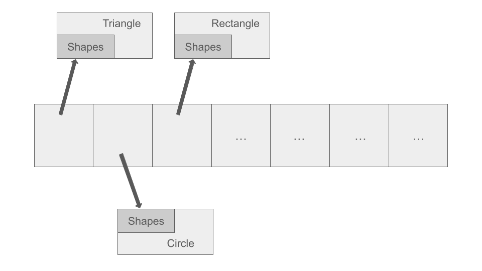
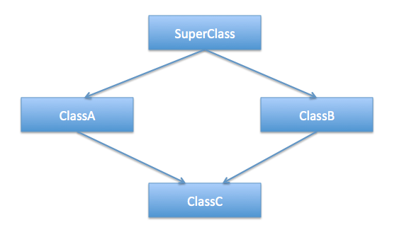
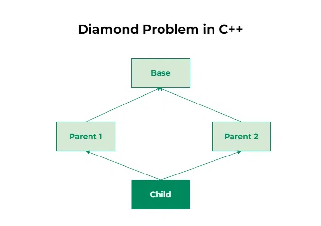
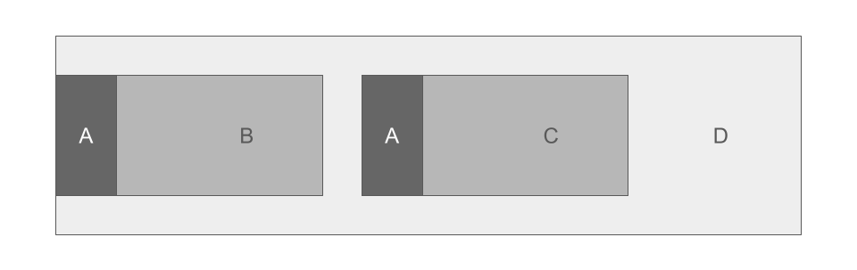
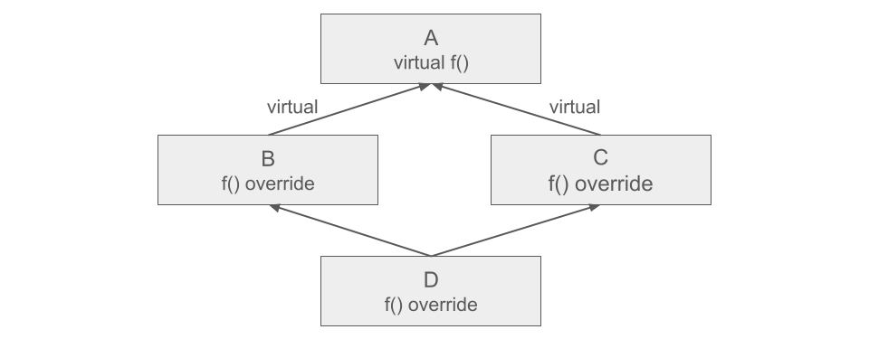

# Колекции от обекти в полиморфна йерархия. Множествено наследяване. Диамантен проблем.

---

##  Съдържание

**Хетерогенен контейнер и полиморфни обекти**

1. [Хетерогенен контейнер](#1-хетерогенен-контейнер)
2. [Триене на полиморфни обекти](#2-триене-на-полиморфни-обекти)
3. [Shallow Copy vs. Deep Copy](#3-shallow-copy-vs-deep-copy)
4. [clone() — реализацията на Deep Copy](#4-clone--реализацията-на-deep-copy)
5. [Prototype Design Pattern](#5-prototype-design-pattern)
6. [Разпознаване и прихващане — Double Dispatch](#6-разпознаване-и-прихващане--double-dispatch)

**Множествено наследяване**

1. [Множествено наследяване](#7-множествено-наследяване)
2. [Конструктори и деструктори при множествено наследяване](#8-конструктори-и-деструктори-при-множествено-наследяване)
3. [Копиране при множествено наследяване](#9-копиране-при-множествено-наследяване)
4.  [Диамантен проблем](#10-диамантен-проблем)
5.  [Виртуално наследяване](#11-виртуално-наследяване)
6.  [Чисто виртуален деструктор](#12-чисто-виртуален-деструктор--абстрактен-клас-без-абстрактни-методи)
7.  [Edge Cases и капани](#13-edge-cases-и-капани)
8.  [Обобщение](#14-обобщение)

---

## Основни дефиниции

> **Хетерогенен контейнер** — колекция, съдържаща обекти от различни типове, но с общ базов клас. Реализира се чрез указатели или умни указатели към базовия клас.

> **`clone()`** — виртуален метод, който всеки наследник имплементира, за да върне точно копие на самия себе си. Позволява копиране без да знаем конкретния тип.

> **Double Dispatch** — техника за извикване на функция, която зависи от типовете на **два** обекта едновременно. Реализира се чрез две последователни виртуални извиквания.

> **Множествено наследяване** — клас наследява от **два или повече** базови класа едновременно.

> **Диамантен проблем** — при множествено наследяване, ако два родителски класа имат общ прародител, той се включва **два пъти** в обекта — дублиране на памет и двусмислие.

> **Виртуално наследяване** — решението на диамантния проблем. Гарантира, че общият прародител се включва само **веднъж** в обекта.

---
## 1. Хетерогенен контейнер

### Проблемът

Имаме йерархия от фигури — `Circle`, `Rectangle`, `Triangle`. Искаме колекция, която съдържа **различни типове едновременно**.

```cpp
// ❌ Не може — масив от обекти не работи при полиморфизъм:
Shape shapes[10];   // слайсинг! Всичко е Shape, не Circle/Rectangle

// ✅ Трябва масив от указатели към базовия клас:
Shape* shapes[10];   // всеки указател може да сочи към различен наследник
```




Масивът съдържа указатели от тип `Shape*`, но те сочат към обекти от различни конкретни типове.

---

### Стар начин — суров масив (Rule of Five)

```cpp
class ShapeCollection {
    Shape** shapes;
    size_t  count;
    size_t  capacity;

    void free() {
        for (size_t i = 0; i < count; i++)
            delete shapes[i];   // virtual ~Shape() → правилният деструктор
        delete[] shapes;
    }

    void copyFrom(const ShapeCollection& other) {
        shapes   = new Shape*[other.capacity];
        count    = other.count;
        capacity = other.capacity;
        for (size_t i = 0; i < count; i++)
            shapes[i] = other.shapes[i]->clone();   // clone() за всеки обект
    }

public:
    ShapeCollection() : shapes(new Shape*[8]), count(0), capacity(8) {}

    // Rule of Five — задължителен при ръчна памет:
    ShapeCollection(const ShapeCollection& other)            { copyFrom(other); }
    ShapeCollection& operator=(const ShapeCollection& other) {
        if (this != &other) { free(); copyFrom(other); }
        return *this;
    }
    ShapeCollection(ShapeCollection&& other) noexcept
        : shapes(other.shapes), count(other.count), capacity(other.capacity) {
        other.shapes = nullptr; other.count = other.capacity = 0;
    }
    ShapeCollection& operator=(ShapeCollection&& other) noexcept {
        if (this != &other) { free(); new(this) ShapeCollection(std::move(other)); }
        return *this;
    }
    ~ShapeCollection() { free(); }

    void add(Shape* shape) { shapes[count++] = shape; }
    void printAll() const {
        for (size_t i = 0; i < count; i++) shapes[i]->print();
    }
};
```

Много код — и лесно се допускат грешки. Всяка промяна в класа изисква промяна в 5 специални функции.

---

### Модерен начин — `vector<unique_ptr<Shape>>` с `clone()`

```cpp
#include <vector>
#include <memory>

class Shape {
public:
    virtual double area()                       const = 0;
    virtual void   print()                      const = 0;
    virtual std::unique_ptr<Shape> clone()      const = 0;   // ← Prototype
    virtual ~Shape() = default;
};

class Circle : public Shape {
    double radius;
public:
    explicit Circle(double r) : radius(r) {}
    double area()  const override { return 3.14159 * radius * radius; }
    void   print() const override { std::cout << "Кръг r=" << radius << "
"; }
    std::unique_ptr<Shape> clone() const override {
        return std::make_unique<Circle>(*this);   // copy constructor на Circle
    }
};

class Rectangle : public Shape {
    double w, h;
public:
    Rectangle(double w, double h) : w(w), h(h) {}
    double area()  const override { return w * h; }
    void   print() const override { std::cout << "Правоъгълник " << w << "x" << h << "
"; }
    std::unique_ptr<Shape> clone() const override {
        return std::make_unique<Rectangle>(*this);
    }
};

class Triangle : public Shape {
    double base, height;
public:
    Triangle(double b, double ht) : base(b), height(ht) {}
    double area()  const override { return 0.5 * base * height; }
    void   print() const override { std::cout << "Триъгълник
"; }
    std::unique_ptr<Shape> clone() const override {
        return std::make_unique<Triangle>(*this);
    }
};
```

```cpp
class ShapeCollection {
    std::vector<std::unique_ptr<Shape>> shapes;

public:
    void add(std::unique_ptr<Shape> shape) {
        shapes.push_back(std::move(shape));
    }

    void printAll() const {
        for (const auto& s : shapes)
            s->print();
    }

    double totalArea() const {
        double total = 0;
        for (const auto& s : shapes)
            total += s->area();
        return total;
    }

    // Копирането изисква clone() — unique_ptr не се копира автоматично:
    ShapeCollection(const ShapeCollection& other) {
        for (const auto& s : other.shapes)
            shapes.push_back(s->clone());
    }
    ShapeCollection& operator=(const ShapeCollection& other) {
        if (this != &other) {
            shapes.clear();
            for (const auto& s : other.shapes)
                shapes.push_back(s->clone());
        }
        return *this;
    }

    // Move и деструктор — компилаторът ги генерира правилно:
    ShapeCollection()                              = default;
    ShapeCollection(ShapeCollection&&)             = default;
    ShapeCollection& operator=(ShapeCollection&&)  = default;
    ~ShapeCollection()                             = default;
};
```

Само copy е ръчен — защото `unique_ptr` не може да се копира автоматично и се нуждае от `clone()`. Всичко останало е `= default`.

```cpp
int main() {
    ShapeCollection col1;
    col1.add(std::make_unique<Circle>(5.0));
    col1.add(std::make_unique<Rectangle>(4.0, 6.0));
    col1.add(std::make_unique<Triangle>(3.0, 8.0));

    col1.printAll();
    std::cout << "Обща площ: " << col1.totalArea() << "
";
    std::cout << "---
";

    // Копиране чрез clone():
    ShapeCollection col2 = col1;
    col2.add(std::make_unique<Circle>(1.0));   // col1 непроменен

    col2.printAll();   // 4 фигури
    std::cout << "---
";
    col1.printAll();   // 3 фигури — независими копия
}
```

```
Кръг r=5
Правоъгълник 4x6
Триъгълник
Обща площ: 130.97
---
Кръг r=5
Правоъгълник 4x6
Триъгълник
Кръг r=1
---
Кръг r=5
Правоъгълник 4x6
Триъгълник
```

```
Кръг r=5
Правоъгълник 4x6
Триъгълник
Кръг r=2.5
Обща площ: 130.97
```

---
## 2. Триене на полиморфни обекти

> **Триене на полиморфен обект** — при `delete Base*` трябва да се извика деструкторът на **конкретния** наследник, не само на базовия клас. Това е гарантирано само ако деструкторът е **виртуален**.

```cpp
// ❌ Без virtual деструктор — извиква се само ~Shape():
class Shape {
public:
    ~Shape() { }   // не е virtual!
};

class Circle : public Shape {
    std::vector<double> data;   // ← не се унищожава!
};

Shape* s = new Circle();
delete s;   // извиква само ~Shape() → ~Circle() пропуснат → leak!
```

```cpp
// ✅ С virtual деструктор — извиква правилния:
class Shape {
public:
    virtual ~Shape() = default;   // задължително!
};

Shape* s = new Circle();
delete s;   // → virtual ~Shape() → ~Circle() ← правилно
```

При `unique_ptr` — триенето е **автоматично** при излизане от scope, но виртуалният деструктор е **пак задължителен**:

```cpp
{
    std::unique_ptr<Shape> s = std::make_unique<Circle>(5.0);
}   // ← unique_ptr извиква delete Shape* → нужен virtual ~Shape()
```

---
## 3. Shallow Copy vs. Deep Copy

> **Shallow Copy (плитко копиране)** — копират се само **указателите**. Оригиналът и копието сочат към **едни и същи обекти** в паметта. Промяна през единия се вижда и през другия.

> **Deep Copy (дълбоко копиране)** — копират се **самите обекти**. Оригиналът и копието са **напълно независими**. Промяна в единия не засяга другия. При полиморфни обекти се реализира чрез `clone()`.

### Визуализация

```
SHALLOW COPY:
col1 ──► [Circle A]  [Rectangle B]  [Triangle C]
              ↑             ↑              ↑
col2 ─────────┘─────────────┘──────────────┘
(col1 и col2 сочат към ЕДНИ И СЪЩИ обекти)

DEEP COPY:
col1 ──► [Circle A]    [Rectangle B]
col2 ──► [Circle A']   [Rectangle B']
(col2 съдържа НОВИ независими копия)
```

### Shallow Copy — кога е правилното

Когато искаш **споделена собственост** — един и същ обект в две структури едновременно:

```cpp
// shared_ptr колекция — default copy е SHALLOW (Rule of Zero работи):
class ShapeRegistry {
    std::vector<std::shared_ptr<Shape>> shapes;
public:
    void add(const std::shared_ptr<Shape>& s) { shapes.push_back(s); }
    // Компилаторът генерира shallow copy автоматично
};

auto circle = std::make_shared<Circle>(5.0);

ShapeRegistry r1, r2;
r1.add(circle);
r2.add(circle);   // СЪЩИЯТ Circle обект в двете колекции

std::cout << circle.use_count() << "\n";   // 3
```

**Примери:** пациент в две отделения, изследовател в два проекта.

### Deep Copy — кога е правилното

Когато искаш **независими копия** — промяна в единото не трябва да засяга другото. Реализира се чрез `clone()`:

```cpp
ShapeCollection col1;
col1.add(std::make_unique<Circle>(5.0));

ShapeCollection col2 = col1;   // deep copy — НОВИ обекти чрез clone()
// col1 и col2 са независими
```

### Обобщение

```
┌──────────────────────┬──────────────────────────┬──────────────────────────┐
│                      │ Shallow Copy             │ Deep Copy                │
├──────────────────────┼──────────────────────────┼──────────────────────────┤
│ Какво се копира      │ Указателите              │ Обектите                 │
│ Обектите             │ Споделени                │ Независими               │
│ Промяна в оригинала  │ Вижда се в копието       │ НЕ се вижда              │
│ Нужен clone()        │ Не                       │ Да — задължително        │
│ unique_ptr           │ Невъзможно (= delete)    │ Ръчен copy + clone()     │
│ shared_ptr           │ Default copy (auto)      │ Ръчен copy + clone()     │
└──────────────────────┴──────────────────────────┴──────────────────────────┘
```

---
## 4. `clone()` — реализацията на Deep Copy

> **`clone()`** — виртуален метод, който всеки конкретен наследник имплементира, за да върне **точно дълбоко копие** на самия себе си. Позволява deep copy без да знаем конкретния тип на обекта.

### Защо е нужен

```cpp
Shape* original = getShape();   // не знаем дали е Circle, Rectangle...

// ❌ Не можем — Shape е абстрактен:
Shape* copy = new Shape(*original);

// ❌ Slicing — губим данните на наследника:
Shape copy = *original;

// ❌ Нарушава абстракцията:
if (dynamic_cast<Circle*>(original))
    copy = new Circle(*dynamic_cast<Circle*>(original));
// При нова фигура → трябва нов if навсякъде!

// ✅ Правилно — clone() полиморфно:
auto copy = original->clone();   // правилният тип, правилното копие
```

### Имплементация

```cpp
class Shape {
    std::string color;   // общ член за всички фигури
public:
    explicit Shape(const std::string& color) : color(color) {}

    const std::string& getColor() const { return color; }

    virtual double area()                          const = 0;
    virtual std::unique_ptr<Shape> clone()         const = 0;
    virtual void print()                           const = 0;
    virtual ~Shape() = default;
};

class Circle : public Shape {
    double      radius;
    std::string label;   // допълнителен член
public:
    Circle(double r, const std::string& color, const std::string& label = "")
        : Shape(color), radius(r), label(label) {}

    double area() const override { return 3.14159 * radius * radius; }

    std::unique_ptr<Shape> clone() const override {
        return std::make_unique<Circle>(*this);
        // копира: radius, color (от Shape), label — всичко!
    }

    void print() const override {
        std::cout << "Кръг ["  << getColor() << "] r=" << radius;
        if (!label.empty()) std::cout << " (" << label << ")";
        std::cout << "  площ=" << area() << "\n";
    }
};

class Rectangle : public Shape {
    double      w, h;
    bool        filled;   // допълнителен член
public:
    Rectangle(double w, double h, const std::string& color, bool filled = false)
        : Shape(color), w(w), h(h), filled(filled) {}

    double area() const override { return w * h; }

    std::unique_ptr<Shape> clone() const override {
        return std::make_unique<Rectangle>(*this);
        // копира: w, h, color, filled — всичко!
    }

    void print() const override {
        std::cout << "Правоъгълник [" << getColor() << "] "
                  << w << "x" << h
                  << (filled ? " запълнен" : " контур")
                  << "  площ=" << area() << "\n";
    }
};

class Triangle : public Shape {
    double      base, height;
    std::string type;   // "равностранен", "равнобедрен", "правоъгълен"
public:
    Triangle(double b, double h, const std::string& color, const std::string& type = "")
        : Shape(color), base(b), height(h), type(type) {}

    double area() const override { return 0.5 * base * height; }

    std::unique_ptr<Shape> clone() const override {
        return std::make_unique<Triangle>(*this);
    }

    void print() const override {
        std::cout << "Триъгълник [" << getColor() << "] "
                  << "b=" << base << " h=" << height;
        if (!type.empty()) std::cout << " " << type;
        std::cout << "  площ=" << area() << "\n";
    }
};
```

### `clone()` в колекцията — deep copy

```cpp
class ShapeCollection {
    std::string                         name;
    std::vector<std::unique_ptr<Shape>> shapes;

    void copyFrom(const ShapeCollection& other) {
        name = other.name + " (копие)";
        for (const auto& s : other.shapes)
            shapes.push_back(s->clone());
    }

    void free() {
        shapes.clear();   // unique_ptr унищожава обектите автоматично
    }

public:
    explicit ShapeCollection(const std::string& name = "") : name(name) {}

    void add(std::unique_ptr<Shape> s) { shapes.push_back(std::move(s)); }

    void printAll() const {
        std::cout << "=== " << name << " ===\n";
        for (const auto& s : shapes) s->print();
        std::cout << "Общо фигури: " << shapes.size() << "\n";
    }

    double totalArea() const {
        double total = 0;
        for (const auto& s : shapes) total += s->area();
        return total;
    }

    ShapeCollection(const ShapeCollection& other)  { copyFrom(other); }

    ShapeCollection& operator=(const ShapeCollection& other) {
        if (this != &other) {
            free();
            copyFrom(other);
        }
        return *this;
    }

    // unique_ptr и vector управляват паметта — деструктор не е нужен
};

int main() {
    ShapeCollection col1("Оригинална колекция");
    col1.add(std::make_unique<Circle>(5.0,       "червен",  "голям"));
    col1.add(std::make_unique<Rectangle>(4.0, 6.0, "син",  true));
    col1.add(std::make_unique<Triangle>(3.0, 4.0,  "зелен", "правоъгълен"));

    col1.printAll();
    std::cout << "Обща площ: " << col1.totalArea() << "\n\n";

    // Deep copy — col2 е напълно независима:
    ShapeCollection col2 = col1;
    col2.add(std::make_unique<Circle>(1.0, "жълт", "малък"));

    col1.printAll();   // 3 фигури — непроменена
    std::cout << "\n";
    col2.printAll();   // 4 фигури — независимо копие
}
```

```
=== Оригинална колекция ===
Кръг [червен] r=5 (голям)  площ=78.5398
Правоъгълник [син] 4x6 запълнен  площ=24
Триъгълник [зелен] b=3 h=4 правоъгълен  площ=6
Общо фигури: 3
Обща площ: 108.54

=== Оригинална колекция ===       ← непроменена след clone
Кръг [червен] r=5 (голям)  площ=78.5398
Правоъгълник [син] 4x6 запълнен  площ=24
Триъгълник [зелен] b=3 h=4 правоъгълен  площ=6
Общо фигури: 3

=== Оригинална колекция (копие) ===
Кръг [червен] r=5 (голям)  площ=78.5398
Правоъгълник [син] 4x6 запълнен  площ=24
Триъгълник [зелен] b=3 h=4 правоъгълен  площ=6
Кръг [жълт] r=1 (малък)  площ=3.14159
Общо фигури: 4
```

---
## 5. Prototype Design Pattern

> **Prototype** е creational design pattern, при който нови обекти се създават чрез **клониране** на вече съществуващ обект (прототипа), вместо да се конструират от нулата. В C++ се реализира чрез `clone()`.

```
Factory   → създава обект ОТ НУЛАТА по зададен тип
Prototype → създава обект ЧРЕЗ КОПИРАНЕ на съществуващ
```

### Употреба

```cpp
auto original = std::make_unique<Circle>(5.0);
original->print();   // Кръг r=5

// Prototype — клонираме без да знаем типа:
auto copy = original->clone();
copy->print();       // Кръг r=5 ← точно копие, независим обект
```

### Кога се ползва

```
✅ Трябва deep copy на полиморфен обект без да знаем конкретния тип
✅ Хетерогенни колекции с copy semantics (ShapeCollection)
✅ Когато конструирането е скъпо — копираме вече конфигуриран обект

❌ Ако обектите не се копират → Factory
❌ Ако искаш споделена собственост → shared_ptr (без clone)
```

---

---
## 6. Разпознаване и прихващане — Double Dispatch

### Проблемът

Имаме `Shape* s1` и `Shape* s2`. Искаме да проверим дали се пресичат. Формулата **зависи от конкретните типове** и на двата обекта:

```
Circle   ↔ Circle    → формула за два кръга
Circle   ↔ Rectangle → различна формула
Triangle ↔ Rectangle → трета формула
```

```cpp
// ❌ Лош дизайн — нарушава абстракцията:
if (dynamic_cast<Circle*>(s1) && dynamic_cast<Circle*>(s2)) { ... }
if (dynamic_cast<Circle*>(s1) && dynamic_cast<Rectangle*>(s2)) { ... }
// При добавяне на нова фигура → трябва да пипаме тук!
```

### Решението — Double Dispatch

Идеята: едно виртуално извикване разкрива типа на **s1**, второто разкрива типа на **s2**.

```cpp
class Triangle;
class Rectangle;
class Circle;

class Shape {
public:
    // Стъпка 1: Разкрива типа на this (s1)
    virtual bool intersectsWith(const Shape* other) const = 0;

    // Стъпка 2: Разкрива типа на other (s2)
    virtual bool intersectsWithCircle(const Circle* other)    const = 0;
    virtual bool intersectsWithRectangle(const Rectangle* other) const = 0;
    virtual bool intersectsWithTriangle(const Triangle* other)  const = 0;

    virtual ~Shape() = default;
};
```

```cpp
class Circle : public Shape {
public:
    bool intersectsWith(const Shape* other) const override {
        // Знаем: this е Circle
        // Не знаем: other е какво → извикваме виртуална функция на other
        return other->intersectsWithCircle(this);
        //                                 ^^^^  this е Circle* const
    }

    bool intersectsWithCircle(const Circle* other) const override {
        // Знаем: this е Circle, other е Circle
        std::cout << "Circle ↔ Circle
";
        return true;  // логиката тук
    }

    bool intersectsWithRectangle(const Rectangle* other) const override {
        // Знаем: this е Circle, other е Rectangle
        std::cout << "Circle ↔ Rectangle
";
        return false;
    }

    bool intersectsWithTriangle(const Triangle* other) const override {
        std::cout << "Circle ↔ Triangle
";
        return false;
    }
};
```

```cpp
Shape* s1 = new Circle(...);
Shape* s2 = new Rectangle(...);

s1->intersectsWith(s2);
// 1. s1->intersectsWith(s2) → Circle::intersectsWith
//    (знаем: s1 е Circle)
// 2. s2->intersectsWithCircle(this) → Rectangle::intersectsWithCircle
//    (знаем: s2 е Rectangle, this е Circle)
// Резултат: "Circle ↔ Rectangle"
```

**Изводът:** При всяко виртуално извикване „разкриваме" конкретния тип. Тъй като имаме два неизвестни типа — трябват две виртуални извиквания.

---
---

## 7. Множествено наследяване

Множественото наследяване позволява на клас да наследи **повече от един базов клас**:

```cpp
class Person {
public:
    std::string name;
    void identify() const { std::cout << "Аз съм " << name << "
"; }
};

class Worker {
public:
    std::string company;
    void work() const { std::cout << "Работя в " << company << "
"; }
};

// StudentWorker наследява и от двата:
class StudentWorker : public Person, public Worker {
public:
    std::string university;
};

int main() {
    StudentWorker sw;
    sw.name       = "Иван";
    sw.company    = "Google";
    sw.university = "СУ";

    sw.identify();   // от Person
    sw.work();       // от Worker
}
```

### Паметта при множествено наследяване

Обектът съдържа базовите части наредени по реда на наследяване:

```
StudentWorker обект:
┌──────────────────┐
│  Person::name    │  ← Person частта
├──────────────────┤
│  Worker::company │  ← Worker частта
├──────────────────┤
│  university      │  ← собствените данни
└──────────────────┘
```

### Конфликт при еднакви имена

Ако двата базови класа имат метод с едно и също име — трябва изрично да се укаже кой:

```cpp
class A {
public:
    void print() { std::cout << "A::print
"; }
};

class B {
public:
    void print() { std::cout << "B::print
"; }
};

class C : public A, public B { };

int main() {
    C c;
    // c.print();       // ❌ двусмислено — компилаторът не знае кое
    c.A::print();       // ✅ изрично
    c.B::print();       // ✅ изрично
}
```

---
## 8. Конструктори и деструктори при множествено наследяване

Конструкторите се извикват **в реда на наследяване** (отляво надясно), деструкторите — в **обратен ред**:

```cpp
class A {
public:
    A()  { std::cout << "A()
"; }
    ~A() { std::cout << "~A()
"; }
};

class B {
public:
    B()  { std::cout << "B()
"; }
    ~B() { std::cout << "~B()
"; }
};

class C {
public:
    C()  { std::cout << "C()
"; }
    ~C() { std::cout << "~C()
"; }
};

class D : public A, public B, public C {
public:
    D()  { std::cout << "D()
"; }
    ~D() { std::cout << "~D()
"; }
};

int main() {
    D d;
}
```

```
A()     ← 1. първи базов клас
B()     ← 2. втори базов клас
C()     ← 3. трети базов клас
D()     ← 4. наследеният клас

~D()    ← обратно
~C()
~B()
~A()
```

### Конструктор с параметри при множествено наследяване

```cpp
class D : public A, public B, public C {
public:
    D(int a, int b, int c) : A(a), B(b), C(c) {
        std::cout << "D()
";
    }
};
```

---
## 9. Копиране при множествено наследяване

Ако `D` има ръчен copy constructor — трябва изрично да копира **всяка** базова част:

```cpp
// ✅ Изрично копиране на всяка базова:
D::D(const D& other) : A(other), B(other), C(other) {
    copyFrom(other);   // само D-специфичните данни
}

D& D::operator=(const D& other) {
    if (this != &other) {
        A::operator=(other);
        B::operator=(other);
        C::operator=(other);
        free();
        copyFrom(other);
    }
    return *this;
}
```

Ако `D` **не дефинира** copy constructor — компилаторът го генерира и автоматично извиква копиращите конструктори на всички базови класове.

### Rule of Zero при множествено наследяване

Ако всички базови класове и `D` ползват само STL типове — Rule of Zero работи:

```cpp
class A {
    std::string nameA;   // string управлява паметта
public:
    A(const std::string& n) : nameA(n) {}
};

class B {
    std::vector<int> dataB;
public:
    B() = default;
};

class D : public A, public B {
    std::string nameD;
public:
    D(const std::string& a, const std::string& d) : A(a), nameD(d) {}
    // Rule of Zero — компилаторът генерира всичко:
    // D(const D&) : A(other), B(other), nameD(other.nameD) {}
};
```

---
## 10. Диамантен проблем

### Структурата






При следната йерархия:

```
        A
       / \
      B   C
       \ /
        D
```

Класове `B` и `C` наследяват от `A`. Клас `D` наследява от `B` и `C`. Резултатът — `D` съдържа **две копия** на `A`.

### Проблемът в кода

```cpp
class A {
public:
    int x = 0;
    A() { std::cout << "A()
"; }
};

class B : public A {
public:
    B() { std::cout << "B()
"; }
};

class C : public A {
public:
    C() { std::cout << "C()
"; }
};

class D : public B, public C {
public:
    D() { std::cout << "D()
"; }
};

int main() {
    D d;
    // d.x = 5;      // ❌ двусмислено — B::A::x или C::A::x?
    d.B::x = 5;      // трябва изрично
    d.C::x = 10;     // второто копие
}
```

```
A()   ← за B
B()
A()   ← за C (второ извикване!)
C()
D()
```

### Представяне в паметта




```
D обект:
┌────────────────┐
│  B::A::x       │  ← първото копие на A (за B)
├────────────────┤
│  B данни       │
├────────────────┤
│  C::A::x       │  ← второто копие на A (за C)
├────────────────┤
│  C данни       │
├────────────────┤
│  D данни       │
└────────────────┘
```

### Диамантен проблем с виртуални функции


```cpp
class A {
public:
    virtual void f() { std::cout << "A::f()
"; }
    virtual ~A() = default;
};

class B : public A {
public:
    void f() override { std::cout << "B::f()
"; }
};

class C : public A {
public:
    void f() override { std::cout << "C::f()
"; }
};

class D : public B, public C {
    // D ТРЯБВА да предефинира f() — иначе двусмислие!
    void f() override { std::cout << "D::f()
"; }
};
```

Без `D::f()` — извикването на `d.f()` е двусмислено (B::f или C::f?).

---
## 11. Виртуално наследяване

### Решението

Виртуалното наследяване гарантира, че общият прародител се включва само **веднъж**:

```cpp
class A {
public:
    int x = 0;
    A() { std::cout << "A()
"; }
};

class B : virtual public A {   // ← virtual
public:
    B() { std::cout << "B()
"; }
};

class C : virtual public A {   // ← virtual
public:
    C() { std::cout << "C()
"; }
};

class D : public B, public C {
public:
    D() { std::cout << "D()
"; }
};

int main() {
    D d;
    d.x = 5;   // ✅ вече не е двусмислено — само едно A
}
```

```
A()   ← само веднъж!
B()
C()
D()
```

### Ред на конструиране при виртуално наследяване

При виртуално наследяване — **`D` е отговорен** за конструирането на `A`, не `B` или `C`:

```cpp
class A {
public:
    A(int val) { std::cout << "A(" << val << ")
"; }
};

class B : virtual public A {
public:
    B() : A(0) { std::cout << "B()
"; }
    // A(0) тук се игнорира ако D явно извиква A!
};

class C : virtual public A {
public:
    C() : A(0) { std::cout << "C()
"; }
};

class D : public B, public C {
public:
    D() : A(42), B(), C() {   // ← D извиква A(42) изрично
        std::cout << "D()
";
    }
};

int main() {
    D d;
}
```

```
A(42)   ← D извиква A директно
B()
C()
D()
```

**Правилото:** Най-наследеният клас (`D`) е отговорен за конструирането на виртуално наследения клас (`A`). Конструкторите на `B` и `C` за `A` се **игнорират**.

### Представяне в паметта при виртуално наследяване




```
D обект (виртуално наследяване):
┌────────────────┐
│  B vptr        │  ← указател към B's vtable (съдържа делта до A)
├────────────────┤
│  B данни       │
├────────────────┤
│  C vptr        │  ← указател към C's vtable
├────────────────┤
│  C данни       │
├────────────────┤
│  D данни       │
├════════════════╡
│  A::x          │  ← само едно копие на A — накрая!
└────────────────┘
```

### Ред на деструкторите

При виртуално наследяване — деструкторите в обратен ред, `A` се унищожава само веднъж:

```
Без virtual: ~D(), ~C(), ~A(), ~B(), ~A()   ← A два пъти!
С virtual:   ~D(), ~C(), ~B(), ~A()         ← A само веднъж ✅
```

---
## 12. Чисто виртуален деструктор — абстрактен клас без абстрактни методи

Понякога искаме клас да е абстрактен, но всичките му методи имат имплементация. Решението — чисто виртуален деструктор:

```cpp
class AbstractBase {
public:
    virtual ~AbstractBase() = 0;   // ← чисто виртуален деструктор
    virtual void doWork() {
        std::cout << "AbstractBase::doWork()
";
    }
};

// Задължително: дефиниция извън класа!
AbstractBase::~AbstractBase() {}

class Concrete : public AbstractBase {
public:
    ~Concrete() override = default;
};

// AbstractBase b;   // ❌ абстрактен — не може
Concrete c;          // ✅
c.doWork();          // AbstractBase::doWork()
```

**Защо дефиницията е задължителна:** деструкторът на `Concrete` автоматично извиква `~AbstractBase()` — ако го няма → linker грешка.

---
## 13. Edge Cases и капани

### Двусмислие при еднакви имена без virtual

```cpp
class A { public: void print() {} };
class B { public: void print() {} };
class C : public A, public B {};

C c;
c.print();       // ❌ двусмислено!
c.A::print();    // ✅
c.B::print();    // ✅
```

---

### Забравено `virtual` при наследяване

```cpp
class B : public A { };   // ❌ без virtual → диамантен проблем
class B : virtual public A { };   // ✅
```

---

### `clone()` без Rule of Zero — забравен copy constructor

```cpp
class Circle : public Shape {
    char* description;   // ← ръчна памет
public:
    Shape* clone() const override {
        return new Circle(*this);   // ❌ shallow copy — description се споделя!
    }
    // Трябва ръчен copy constructor за дълбоко копиране
};
```

---

### Виртуален деструктор при множествено наследяване

```cpp
class A { public: ~A() {} };          // ❌ не е virtual!
class B : virtual public A { };
class C : virtual public A { };
class D : public B, public C { };

A* ptr = new D();
delete ptr;   // ❌ само ~A() → ~D() не се извиква → leak!

// ✅ Решение:
class A { public: virtual ~A() = default; };
```

---

### Конструкторът на виртуалния базов клас при `D`

```cpp
class A {
public:
    A(int x) { }   // без default конструктор!
};

class B : virtual public A {
public:
    B() : A(0) { }   // OK само ако D не наследява
};

class D : public B {
public:
    D() : B() { }
    // ❌ ГРЕШКА — D трябва сам да извика A(x)!
    // ✅ D() : A(42), B() { }
};
```

---
## 14. Обобщение

### Хетерогенен контейнер

```
Стар начин:   Shape** → Rule of Five задължителен
Модерен начин: vector<unique_ptr<Shape>> → Rule of Zero
               НО: copy constructor трябва ръчно (clone)
```

### `clone()` — задължително при полиморфно копиране

```
Всеки конкретен наследник имплементира:
Shape* clone() const override { return new DerivedClass(*this); }
```

### Множествено наследяване

```
Конструктори: отляво надясно по реда на декларация
Деструктори:  в обратен ред
Copy:         трябва изрично Base1(other), Base2(other) в init list
              и Base1::operator=(other) в тялото
Rule of Zero: работи ако всички базови са STL типове
```

### Диамантен проблем и виртуално наследяване

```
Проблем:   B и C наследяват A → D има две копия на A
Решение:   class B : virtual public A
           class C : virtual public A
           → само едно копие на A в D
           → D е отговорен за конструирането на A
```

### Правила

```
✅ Виртуален деструктор в базовия клас при полиморфна йерархия
✅ clone() в ВСЕКИ конкретен наследник при полиморфно копиране
✅ При множествено наследяване: изрично Base1(other) в copy constructor
✅ При виртуално наследяване: D извиква конструктора на A изрично
✅ vector<unique_ptr<Base>> + clone() = модерен хетерогенен контейнер

❌ Без virtual деструктор → leak при delete Base*
❌ Без clone() → не може правилно копиране на полиморфни обекти
❌ Диамантен проблем без virtual → две копия на прародителя
❌ При virtual наследяване: B и C не инициализират A — само D го прави
❌ d.x при диамант без virtual → двусмислие (B::A::x или C::A::x?)
```

> **Основен извод:** Хетерогенен контейнер се реализира чрез `vector<unique_ptr<Base>>` или `vector<shared_ptr<Base>>`. Копирането изисква `clone()` в  наследниците. Множественото наследяване работи правилно при ясна йерархия, но диамантният проблем изисква `virtual` наследяване, при което най-наследеният клас е отговорен за конструирането на общия прародител.
